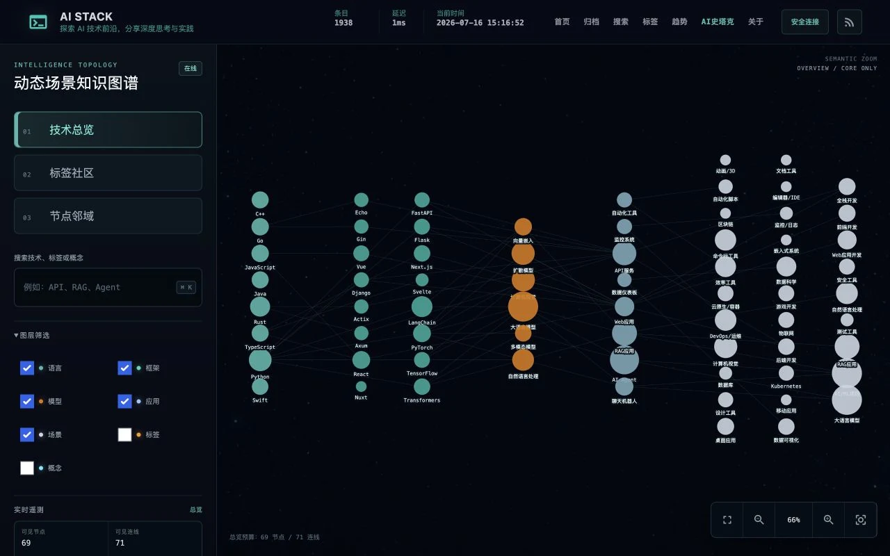
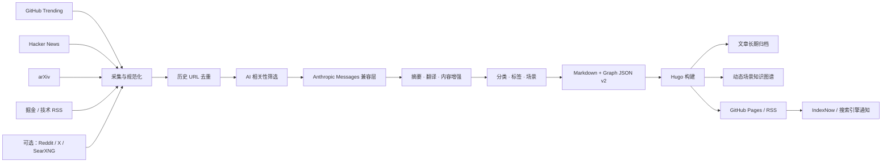

<div align="center">


<h1>AI Stack · AI 史塔克</h1>

<p><strong>AI 情报长期档案 + 动态场景知识图谱</strong></p>
<p>把每日汹涌的 AI 信息流，变成可回溯、可检验、可探索的技术脉络。</p>
<p><em>From AI firehose to a living knowledge graph.</em></p>

<a href="https://github.com/g5n-dev/ai-stack/actions/workflows/deploy.yml"></a>


<a href="https://ai-stack.site/"></a>

<p>
  <a href="https://ai-stack.site/"><strong>在线站点</strong></a>
  ·
  <a href="https://ai-stack.site/scenarios/"><strong>探索图谱</strong></a>
  ·
  <a href="#快速开始"><strong>快速开始</strong></a>
  ·
  <a href="./docs/README.md"><strong>详细文档</strong></a>
</p>

</div>

AI Stack 不是另一份稍纵即逝的新闻列表。它持续采集 AI 技术信息，经过历史去重、相关性筛选与结构化处理，将文章、标签、技术栈和应用场景沉淀为可搜索的长期档案，并用分层知识图谱呈现它们之间的关系。

## 动态演示

<a href="https://ai-stack.site/scenarios/">
  
</a>

<p align="center">切换技术总览与标签社区，搜索节点，展开邻域，沿关联路径追踪文章。</p>

<details>
<summary>查看完整静态界面</summary>



</details>

## 三项核心价值

| 01 · 多源情报雷达 | 02 · 可追溯内容档案 | 03 · 活的场景图谱 |
| --- | --- | --- |
| 聚合 GitHub Trending、Hacker News、arXiv、掘金与技术 RSS；本地还可按需启用 Reddit、X/Twitter 和 SearXNG 兜底。 | 在模型处理前执行历史 URL 去重，再进行筛选、摘要、翻译、结构化生成和来源回链，让每条情报有出处、可复查。 | 以“技术总览 → 标签社区 → 节点邻域”渐进探索，只按需加载当前子图，避免把全量密图一次性塞进浏览器。 |

## 快速开始

### 路径 A：只看站点与图谱

适合体验终端主题、文章归档和知识图谱。无需 Python 或模型密钥，只需 Git 与 Hugo Extended；建议与线上保持一致，使用 Hugo `0.153.4`。

```bash
git clone https://github.com/g5n-dev/ai-stack.git
cd ai-stack/blog
hugo server -D
```

打开 [http://localhost:1313](http://localhost:1313)。仓库已经包含站点内容和生成后的图谱数据。

### 路径 B：运行完整情报流水线

需要 Python `3.11+`、Hugo Extended，以及一个兼容 Anthropic Messages API 的模型端点。

```bash
git clone https://github.com/g5n-dev/ai-stack.git
cd ai-stack

# 创建 venv、安装依赖，并从 .env.example 生成 .env
bash scripts/setup.sh

# 填入模型端点、模型名与密钥
nano .env

# 预检、采集、处理、构建并启动 Hugo
bash scripts/run_local.sh --serve
```

完整流水线会调用外部数据源和模型 API，可能产生费用。也可以缩短路径：

```bash
# 只生成 Markdown，不构建 Hugo
bash scripts/run_local.sh --skip-build

# 生成内容并构建静态站点
bash scripts/run_local.sh
```

## 工作原理



采集、处理、发布和展示彼此解耦。新增来源主要落在 `crawler/`，内容理解与图谱生成位于 `processor/`，Hugo 主题消费 Markdown 与拆分后的图谱 JSON。

## 核心能力

| 能力 | 说明 |
| --- | --- |
| 多源采集 | 五类核心来源由生产任务持续采集；Reddit 与 X/Twitter 可在本地配置启用，CI 运行档位默认关闭。 |
| 历史去重 | 使用规范化外链识别已归档内容，先去重、再限制每来源处理量，避免重复消耗模型和覆盖旧文章。 |
| AI 内容管线 | 自动完成相关性筛选、摘要、翻译、评论、标签与场景分析，并保留原始来源链接。 |
| 模型兼容层 | 基于 Anthropic SDK 与 Messages 请求结构，模型和 `base_url` 可配置；包含 MiniMax thinking-only/截断响应的兼容处理。 |
| GitHub 项目增强 | 为仓库内容补充 DeepWiki 上下文与结构化技术信息，形成更适合长期阅读的项目档案。 |
| 分层知识图谱 | 首屏核心图、社区摘要、热点节点和焦点分片按层加载；搜索覆盖完整索引，画布只渲染当前子图。 |
| 自动发布与监测 | Actions 生成文章与图谱、校验数据、构建 Pages、通知搜索引擎，并独立检查线上数据新鲜度。 |

## 配置与部署

### 环境变量

`scripts/setup.sh` 会从 [`.env.example`](./.env.example) 创建本地 `.env`。密钥只应放在本地环境或 GitHub Actions Secrets 中。

| 变量 | 必需 | 用途 |
| --- | --- | --- |
| `ANTHROPIC_AUTH_TOKEN` | 是 | Anthropic Messages 兼容端点的认证令牌。 |
| `ANTHROPIC_BASE_URL` | 是 | 模型 API 基础地址；示例配置使用 MiniMax Anthropic 兼容端点。 |
| `ANTHROPIC_MODEL` | 建议 | 显式指定模型；兼容层也提供后端相关默认值。 |
| `SEARXNG_BASE_URL` | 否 | 自建 SearXNG 搜索地址；未配置时可尝试公共实例。 |

进一步配置集中在：

- [`config/sources.yaml`](./config/sources.yaml)：来源、抓取数量、超时与搜索兜底。
- [`config/anthropic.yaml`](./config/anthropic.yaml)：模型参数、筛选、摘要、生成、标签和场景分析。
- [`config/publisher.yaml`](./config/publisher.yaml)：微信、X/Twitter、Telegram 推送，默认关闭。
- [`runtime_profile.py`](./runtime_profile.py)：本地与 CI 的来源预算、并发和生成档位。

### GitHub Pages

[`Build and Deploy`](./.github/workflows/deploy.yml) 有三种触发方式：

- 每小时第 `17` 分钟自动运行，避开整点拥堵；
- 推送到 `main` 时运行；
- 在 Actions 页面手动触发。

生产工作流固定 Python `3.11`、Node.js `22` 与 Hugo Extended `0.153.4`。推送到 `main` 时直接验证并部署已评审的内容快照，避免代码与样式更新被长时间抓取阻塞；小时任务和手动任务才执行抓取、历史质量清单、图谱重建与生成数据提交。两条路径都会构建 Hugo 与 Pagefind、部署 GitHub Pages并通知搜索引擎。独立的 [`monitoring.yml`](./.github/workflows/monitoring.yml) 每 6 小时检查仓库与线上图谱的新鲜度。

生产地址为 [https://ai-stack.site/](https://ai-stack.site/)，图谱入口为 [https://ai-stack.site/scenarios/](https://ai-stack.site/scenarios/)。域名、Secrets 与 Pages 设置见 [部署指南](./DEPLOYMENT.md)。

## 项目结构

```text
ai-stack/
├── crawler/             # 数据源、搜索兜底与抓取编排
├── processor/           # 模型兼容层、内容处理、标签与图谱
├── publisher/           # 微信、X/Twitter、Telegram 发布器
├── ai_stack/            # 领域模型、清单、迁移与流水线 CLI
├── blog/                # Hugo 内容、主题、静态资源与 Graph JSON
├── config/              # 来源、模型、发布与标签配置
├── scripts/             # 本地运行、校验、构建和运维脚本
├── tests/               # Python、JavaScript 与 Playwright 测试
├── docs/                # 架构、部署和操作文档
└── .github/workflows/   # PR CI、生产部署、监控与内容维护
```

## 文档

| 文档 | 内容 |
| --- | --- |
| [详细使用文档](./docs/README.md) | 安装、配置、日常命令与故障排查。 |
| [部署指南](./DEPLOYMENT.md) | GitHub Pages、自定义域名、Secrets 与部署验证。 |
| [分支架构](./docs/BRANCH_ARCHITECTURE.md) | 分支职责、同步机制与部署边界。 |
| [CI 信任模型](./docs/architecture/ci-trust-model.md) | 工作流权限、发布边界与安全假设。 |
| [系统设计](./docs/系统设计文档.md) | 数据流、AI 处理、展示层和扩展设计。 |

## 贡献

欢迎围绕新数据源、内容质量、图谱交互、性能与可靠性提交改进。请让一次改动保持单一职责，并先运行与改动范围对应的测试。

```bash
git checkout -b feature/your-change
python3 -m pip install pytest==9.0.3
python3 -m unittest tests.test_tag_graph_runtime tests.test_generate_content_guards
python3 -m pytest -q tests/test_graph_deploy_contract.py tests/test_site_header_contract.py
```

- Bug 与功能建议：[GitHub Issues](https://github.com/g5n-dev/ai-stack/issues)
- 方案讨论与经验分享：[GitHub Discussions](https://github.com/g5n-dev/ai-stack/discussions)
- PR 检查规则：[`.github/workflows/ci.yml`](./.github/workflows/ci.yml)

<div align="center">

如果 AI Stack 帮你从信息噪声中找到长期线索，欢迎点亮一个 Star。

<strong>Built for traceable intelligence, not disposable feeds.</strong>

</div>
