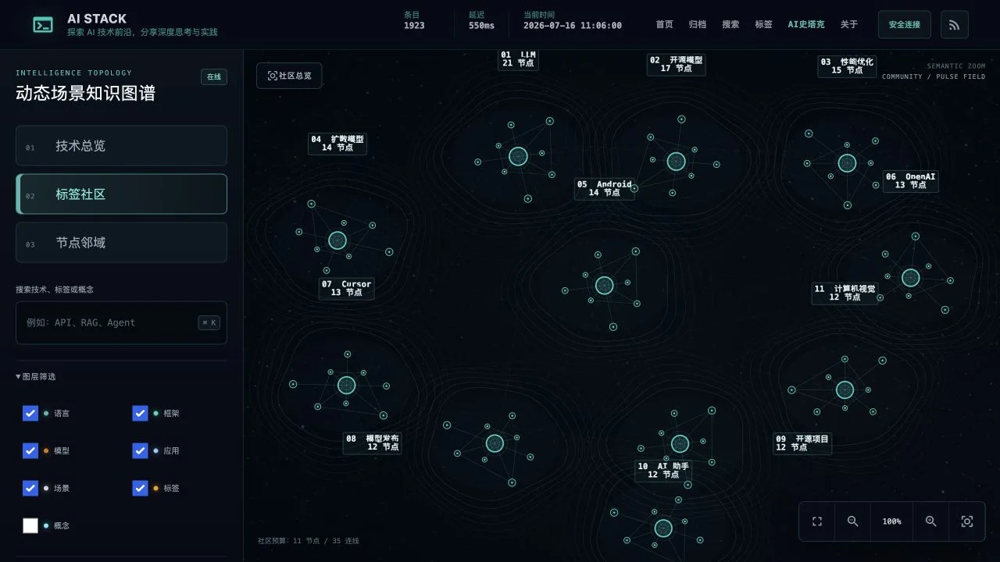
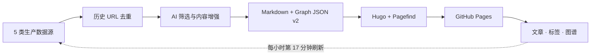
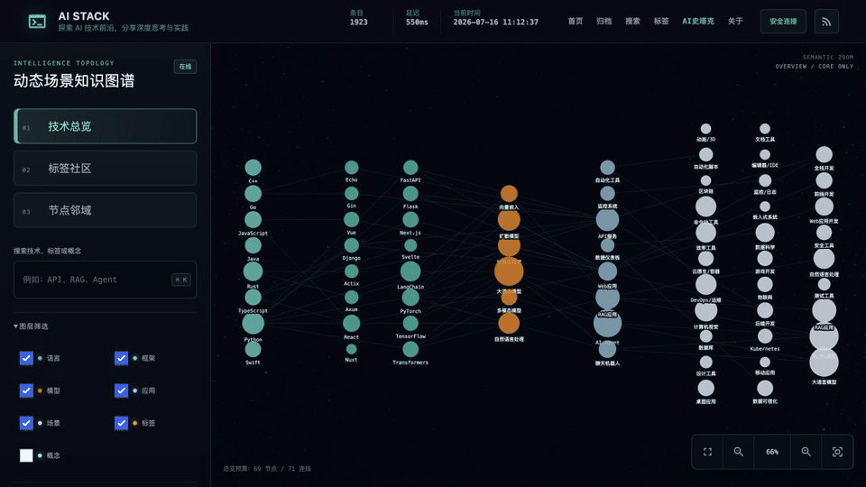
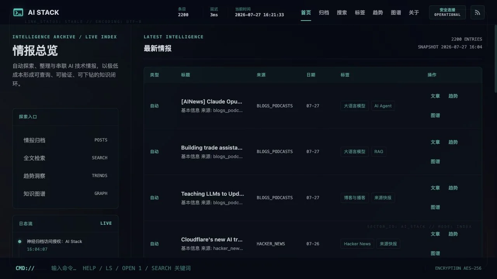
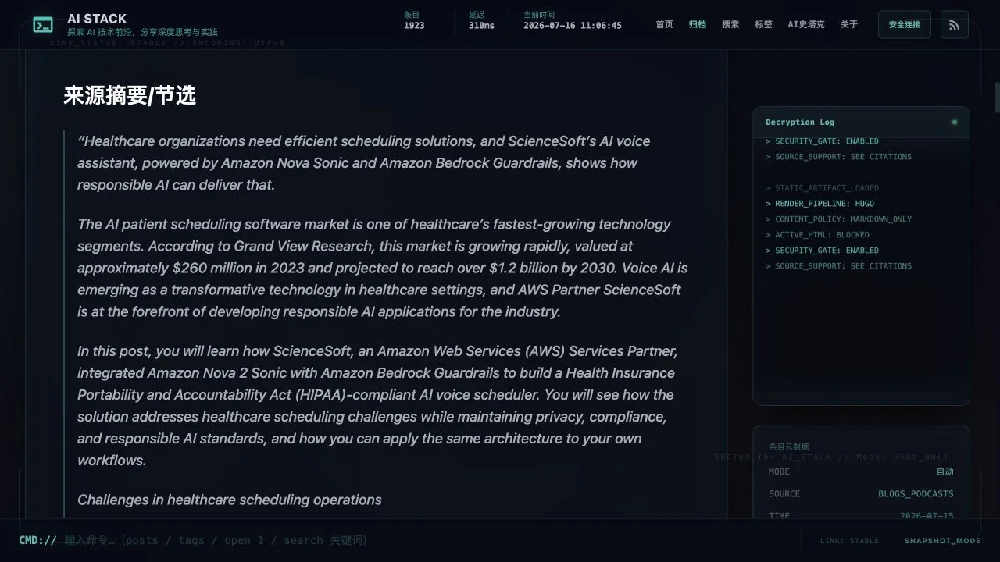

<div align="center">

<h1>AI Stack · AI 史塔克</h1>

<p><strong>开源的 AI 情报长期档案与动态场景知识图谱</strong></p>
<p>从多源采集、历史去重、AI 精炼，到文章归档、图谱探索与自动发布，一个仓库跑通最小闭环。</p>
<p><em>From AI firehose to a living knowledge graph.</em></p>

<a href="https://github.com/g5n-dev/ai-stack/actions/workflows/deploy.yml"></a>
<a href="https://github.com/g5n-dev/ai-stack/actions/workflows/monitoring.yml"></a>

<a href="https://ai-stack.site/"></a>

<p>
  <a href="https://ai-stack.site/"><strong>🚀 在线体验</strong></a>
  ·
  <a href="https://ai-stack.site/scenarios/"><strong>🕸️ 探索图谱</strong></a>
  ·
  <a href="#-60-秒开始"><strong>⚡ 60 秒开始</strong></a>
  ·
  <a href="./docs/README.md"><strong>📚 使用文档</strong></a>
</p>

</div>

<a href="https://ai-stack.site/scenarios/">
  
</a>

<p align="center"><sub>真实生产界面 · 社区聚类、语义缩放、图层筛选与按需加载</sub></p>

## ⚡ 为什么是 AI Stack

| 一仓闭环 | 长期可追溯 | 活的知识图谱 |
| --- | --- | --- |
| **采集 → 精炼 → 归档 → 发布** 全部在一个仓库完成，不依赖数据库、消息队列或常驻服务。 | 先做历史 URL 去重，再生成摘要、标签和场景；文章保留原始来源，结论可回看、可复查。 | 以“技术总览 → 标签社区 → 节点邻域”渐进探索，只加载当前需要的子图。 |
| ⚙️ 最小系统也能独立运行 | 🧭 情报不会变成一次性信息流 | 🕸️ 从文章继续追到关系与场景 |

> [!IMPORTANT]
> 公开仓库使用标准 GitHub-hosted runner 与 GitHub Pages 时，托管和调度的固定基础设施成本可以接近 **0**。模型 API 与可选自定义域名可能产生外部费用；只浏览线上站点或本地启动 UI 不需要模型密钥。

## 🔁 最小闭环，几乎零基础设施成本

AI Stack 把一个容易失控的情报工程压缩成可版本化的静态闭环：内容是 Markdown，关系是 Graph JSON v2，检索由 Pagefind 生成，发布目标是 GitHub Pages。



| 使用方式 | 需要什么 | 成本边界 |
| --- | --- | --- |
| 🌐 在线浏览 | 浏览器 | 无需账户、无需密钥 |
| 💻 本地启动 UI | Git + Hugo Extended | 不调用模型，不需要 Python |
| 🤖 完整数据刷新 | Python 3.11+ + Anthropic Messages 兼容端点 | 仅模型 API 与可选自定义域名可能产生费用 |

成本说明参考 GitHub 官方的 [Actions 计费说明](https://docs.github.com/en/actions/concepts/billing-and-usage) 与 [Pages 使用限制](https://docs.github.com/en/pages/getting-started-with-github-pages/github-pages-limits)。

## 🎬 看见它在工作

<a href="https://ai-stack.site/scenarios/">
  
</a>

<p align="center"><sub>8.4 秒真实交互：技术总览 → 标签社区 → 搜索 → 节点邻域 → 详情联动</sub></p>

## 🛰️ 从信息洪流到可追溯洞察


<table>
  <tr>
    <td width="50%" valign="top">
      <a href="https://ai-stack.site/">
        
      </a>
      <br />
      <sub><strong>01 · 长期归档</strong><br />跨来源内容沉淀为可搜索、可按日期回看的技术档案。</sub>
    </td>
    <td width="50%" valign="top">
      
      <br />
      <sub><strong>02 · 文章精炼</strong><br />来源摘要、结构化正文、标签与元数据保留在同一页面。</sub>
    </td>
  </tr>
</table>

### 03 · 分层图谱

| 模式 | 回答的问题 | 加载策略 |
| --- | --- | --- |
| **技术总览** | AI 技术栈由哪些核心层构成？ | 首屏仅加载核心图 |
| **标签社区** | 当前内容自然聚成哪些主题？ | 先加载社区摘要，再按需展开热点 |
| **节点邻域** | 一个技术与哪些强关系节点相连？ | 只请求当前节点的一跳子图 |

搜索覆盖完整索引，但画布永远只绘制当前子图；密集数据留在 Worker 中切片，避免一次性渲染全量节点与边。

## ⚡ 60 秒开始

### 路径 A：只看站点与图谱

无需 Python、数据库、容器或模型密钥。仓库已包含 Markdown 内容与生成后的图谱数据。

```bash
git clone https://github.com/g5n-dev/ai-stack.git
cd ai-stack/blog
hugo server -D
```

打开 [http://localhost:1313](http://localhost:1313)，或直接访问 [ai-stack.site](https://ai-stack.site/)。

### 路径 B：运行完整情报流水线

需要 Python `3.11+`、Hugo Extended，以及一个兼容 Anthropic Messages API 的模型端点。

```bash
git clone https://github.com/g5n-dev/ai-stack.git
cd ai-stack

# 创建虚拟环境、安装依赖，并从 .env.example 生成 .env
bash scripts/setup.sh

# 填入模型端点、模型名与密钥
nano .env

# 预检、采集、处理、构建并启动 Hugo
bash scripts/run_local.sh --serve
```

<details>
<summary><strong>更多本地运行方式</strong></summary>

```bash
# 只生成 Markdown，不构建 Hugo
bash scripts/run_local.sh --skip-build

# 生成内容并构建静态站点
bash scripts/run_local.sh
```

</details>

## 🧠 核心能力

| 能力 | 说明 |
| --- | --- |
| 多源采集 | 生产任务持续采集 GitHub Trending、Hacker News、arXiv、掘金与博客/播客 RSS；Reddit、X/Twitter 与 SearXNG 可在本地按需启用。 |
| 历史去重 | 使用规范化外链识别已归档内容，先去重、再限制来源预算，避免重复消耗模型和覆盖旧文章。 |
| AI 内容管线 | 自动完成相关性筛选、摘要、翻译、评论、标签与场景分析，并保留原始来源链接。 |
| 模型兼容层 | 基于 Anthropic SDK 与 Messages 请求结构，模型和 `base_url` 可配置。 |
| GitHub 项目增强 | 为仓库内容补充 DeepWiki 上下文与结构化技术信息，形成适合长期阅读的项目档案。 |
| 分层知识图谱 | 核心图、社区摘要、热点节点与焦点分片分层加载；搜索覆盖完整索引，画布只渲染当前子图。 |
| 自动发布与监测 | Actions 生成内容与图谱、校验数据、构建 Pages、通知搜索引擎，并独立检查线上数据新鲜度。 |

## 🚦 自动化与可靠性

| 触发方式 | 执行内容 | 设计目的 |
| --- | --- | --- |
| Push 到 `main` | 验证并部署已提交快照，不调用模型 | 代码与样式更新快速上线 |
| 每小时第 `17` 分钟 | 抓取、质量清单、图谱重建、生成数据提交与部署 | 自动刷新情报档案 |
| 手动触发 | 按需执行完整刷新 | 故障恢复与运营控制 |
| 每 `6` 小时第 `23` 分钟 | 检查仓库与线上图谱新鲜度 | 及时发现数据停滞 |

生产工作流固定使用 Python `3.11`、Node.js `22` 与 Hugo Extended `0.153.4`。两条部署路径都会构建 Hugo 与 Pagefind、发布 GitHub Pages，并按配置通知搜索引擎。

## ⚙️ 配置与部署

`scripts/setup.sh` 会从 [`.env.example`](./.env.example) 创建本地 `.env`。密钥只应放在本地环境或 GitHub Actions Secrets 中。

| 变量 | 必需 | 用途 |
| --- | --- | --- |
| `ANTHROPIC_AUTH_TOKEN` | 是 | Anthropic Messages 兼容端点的认证令牌 |
| `ANTHROPIC_BASE_URL` | 是 | 模型 API 基础地址 |
| `ANTHROPIC_MODEL` | 建议 | 显式指定模型 |
| `SEARXNG_BASE_URL` | 否 | 可选的自建 SearXNG 搜索地址 |

<details>
<summary><strong>配置文件与项目结构</strong></summary>

- [`config/sources.yaml`](./config/sources.yaml)：来源、抓取数量、超时与搜索兜底。
- [`config/anthropic.yaml`](./config/anthropic.yaml)：模型参数、筛选、摘要、生成、标签与场景分析。
- [`config/publisher.yaml`](./config/publisher.yaml)：微信、X/Twitter、Telegram 发布器，默认关闭。
- [`runtime_profile.py`](./runtime_profile.py)：本地与 CI 的来源预算、并发与生成档位。

```text
ai-stack/
├── crawler/             # 数据源、搜索兜底与抓取编排
├── processor/           # 模型兼容层、内容处理、标签与图谱
├── publisher/           # 可选发布器
├── ai_stack/            # 领域模型、清单、迁移与流水线 CLI
├── blog/                # Hugo 内容、主题、静态资源与 Graph JSON
├── config/              # 来源、模型、发布与标签配置
├── scripts/             # 本地运行、校验、构建与运维脚本
├── tests/               # Python、JavaScript 与 Playwright 测试
├── docs/                # 架构、部署与操作文档
└── .github/workflows/   # PR CI、生产部署、监控与内容维护
```

</details>

生产地址为 [https://ai-stack.site/](https://ai-stack.site/)，图谱入口为 [https://ai-stack.site/scenarios/](https://ai-stack.site/scenarios/)。域名、Secrets 与 Pages 设置见 [部署指南](./DEPLOYMENT.md)。

## 📚 文档

| 文档 | 内容 |
| --- | --- |
| [详细使用文档](./docs/README.md) | 安装、配置、日常命令与故障排查 |
| [部署指南](./DEPLOYMENT.md) | GitHub Pages、自定义域名、Secrets 与部署验证 |
| [分支架构](./docs/BRANCH_ARCHITECTURE.md) | 分支职责、同步机制与部署边界 |
| [历史文章质量报告](./docs/HISTORICAL_CONTENT_QUALITY.md) | 异常识别、透明归档、标签修复与验收统计 |
| [CI 信任模型](./docs/architecture/ci-trust-model.md) | 工作流权限、发布边界与安全假设 |
| [系统设计](./docs/系统设计文档.md) | 数据流、AI 处理、展示层与扩展设计 |

## 🤝 贡献

欢迎围绕新数据源、内容质量、图谱交互、性能与可靠性提交改进。请让一次改动保持单一职责，并先运行与改动范围对应的测试。

```bash
git checkout -b feature/your-change
python3 -m pip install pytest==9.0.3
python3 -m unittest tests.test_tag_graph_runtime tests.test_generate_content_guards
python3 -m pytest -q tests/test_graph_deploy_contract.py tests/test_site_header_contract.py
```

- Bug 与功能建议：[GitHub Issues](https://github.com/g5n-dev/ai-stack/issues)
- 方案讨论与经验分享：[GitHub Discussions](https://github.com/g5n-dev/ai-stack/discussions)
- PR 检查规则：[`.github/workflows/ci.yml`](./.github/workflows/ci.yml)

<div align="center">

<h3>把一次性信息流，变成会持续生长的技术档案。</h3>

<p>
  <a href="https://ai-stack.site/"><strong>🚀 打开 AI Stack</strong></a>
  ·
  <a href="https://github.com/g5n-dev/ai-stack"><strong>⭐ 点亮 Star</strong></a>
  ·
  <a href="https://github.com/g5n-dev/ai-stack/fork"><strong>🍴 Fork 最小闭环</strong></a>
</p>

<strong>Built for traceable intelligence, not disposable feeds.</strong>

</div>
