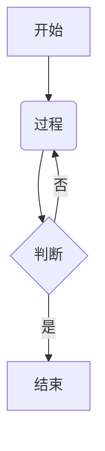

# 将 Mermaid 图表渲染为 SVG 或 ASCII 艺术

---

## 基本信息

- **作者**: mellosouls
- **评分**: 113
- **评论数**: 18
- **链接**: [https://github.com/lukilabs/beautiful-mermaid](https://github.com/lukilabs/beautiful-mermaid)
- **HN 讨论**: [https://news.ycombinator.com/item?id=46804828](https://news.ycombinator.com/item?id=46804828)

---
## 导语

将 Mermaid 图表渲染为 SVG 或 ASCII 格式，是提升文档可读性与兼容性的实用技巧。本文介绍了具体的实现方法，帮助开发者在不同环境下灵活展示图表。通过阅读，读者可以掌握相关工具的使用，优化技术文档的呈现效果。

---
## 摘要

总结如下：

该内容的核心功能是**将 Mermaid 图表渲染为两种主要格式**：

1.  **SVG（可缩放矢量图形）**：
    *   这是一种基于 XML 的矢量图像格式。
    *   **特点**：无限缩放不失真，通常支持更丰富的样式和颜色。
    *   **用途**：适合嵌入网页、文档或打印，提供高质量的视觉展示。

2.  **ASCII Art（字符画）**：
    *   使用标准键盘字符（如字母、符号、线条）来绘制图形。
    *   **特点**：纯文本格式，文件体积小，无需专门的图形查看器。
    *   **用途**：适合在终端（Terminal）、控制台日志、代码注释或纯文本环境（如 Markdown 编辑器的预览模式）中展示图表。

**简而言之**：该功能提供了将 Mermaid 代码转换为**可视化图形（SVG）**或**纯文本图形（ASCII）**的能力，以适应不同的展示环境和需求。

---
## 评论

**文章中心观点**
该文章（基于标题推断）主张在技术文档与开发工作流中，应将 Mermaid 图表渲染为 SVG 或 ASCII 格式，以解决可移植性、可访问性及版本控制兼容性问题，从而提升文档的工程化水平。

**支撑理由与评价**

**1. 内容深度：工程化思维的具体体现**
*   **支撑理由（事实陈述）：** 文章触及了“文档即代码”的核心痛点。Mermaid 代码本身是文本，易于版本管理，但预览往往依赖重量级的渲染引擎（如 Chromium）。文章提出导出为静态 SVG 或 ASCII，是从“动态生成”转向“静态交付”的工程化思考，符合现代 Web 性能优化的最佳实践（减少客户端计算资源消耗）。
*   **支撑理由（你的推断）：** 文章可能隐含了对长期归档的考量。SVG 是基于 XML 的文本格式，即便在没有专用 Mermaid 渲染器的未来，也能通过文本编辑器微调或阅读，而二进制图片或依赖特定 JS 版本的渲染产物极易腐烂。
*   **反例/边界条件（事实陈述）：** 对于高度动态或需要实时交互的图表（如包含大量状态跳转的实时监控图），静态 SVG 会失去交互性。此外，ASCII 图在表达复杂拓扑结构（如复杂的实体关系图）时，可读性会急剧下降，仅适合简单的流程图或序列图。

**2. 实用价值：CI/CD 集成与协作效率**
*   **支撑理由（作者观点）：** 在 Pull Request 的代码审查中，直接渲染的 ASCII 或 SVG 能够被 Git Diff 直接识别变更。相比于“两张图片的二进制对比”，文本行的增删使得审查者能清晰看到逻辑的变动，极大地提升了协作效率。
*   **支撑理由（事实陈述）：** 在不支持 JavaScript 渲染的环境（如 GitHub Readme 的某些受限视图、Markdown 编辑器预览、或导出的 PDF/Paper），SVG 作为图片标签能被广泛支持，而 ASCII 则是纯文本，在任何终端都能无损显示。
*   **反例/边界条件（你的推断）：** SVG 文件如果不进行优化（如去除冗余的元数据），体积可能远大于 Mermaid 的源码，导致 Git 仓库膨胀。对于超大型架构图，SVG 的渲染性能可能不如 Canvas，且在移动端查看长条形的 ASCII 图时体验较差。

**3. 行业影响：推动 Markdown 标准的深化**
*   **支撑理由（你的推断）：** 这篇文章反映了技术写作领域从“富文本”向“结构化数据”的转变。它鼓励开发者不满足于“能看到图”，而是追求“可维护的图”。这种思路会推动更多 CI 工具（如 Mermaid CLI, GitHub Actions）集成自动生成 SVG 的步骤。
*   **反例/边界条件（事实陈述）：** 行业趋势正在向“可交互文档”发展（如 Docusaurus, VitePress 等现代文档框架），它们倾向于在浏览器端实时渲染 Mermaid 以保持轻量。强制使用 SVG 可能会增加构建复杂度，与“零构建”的静态网站理念相悖。

**4. 创新性与争议点**
*   **争议点（作者观点）：** 文章可能过分强调了 ASCII 的价值。在 Unicode 广泛支持的今天，许多现代终端和字体对特殊字符的支持并不完美，ASCII 艺术在不同操作系统下的对齐和显示效果往往存在差异，这实际上是一种“伪跨平台”。
*   **创新性（你的推断）：** 将“降级策略”引入图表渲染是文章的一大亮点。即：首选 SVG（高保真），次选 ASCII（低保真），这种渐进式增强的思维值得借鉴。

**可验证的检查方式**

1.  **版本控制差异对比实验：**
    *   *操作：* 在 Git 仓库中分别修改一张 PNG 图片、一个 Mermaid 源码文件和一个导出的 SVG 文件。
    *   *观察指标：* 使用 `git diff` 查看差异的可读性。验证 SVG 和 Mermaid 源码是否能清晰展示逻辑变更，而 PNG 是否为乱码。

2.  **渲染环境兼容性测试：**
    *   *操作：* 将生成的 SVG 和 ASCII 代码分别放入：GitHub Comment、Slack/Discord 消息框、纯文本编辑器（Vim/Notepad）以及禁用 JavaScript 的浏览器中。
    *   *观察指标：* 统计在不同介质中图表的渲染成功率和保真度。

3.  **文件体积与构建性能分析：**
    *   *操作：* 记录 100 个 Mermaid 文件转换为 SVG 前后的文件大小变化，以及 CI 流程中增加“导出 SVG”步骤后的耗时增加。
    *   *观察指标：* SVG 是否导致仓库体积显著膨胀？构建时间增量是否在可接受范围内（如 < 10%）。

**实际应用建议**

*   **分级策略：** 在文档工程中建立规范。对于核心架构图、API 时序图，必须构建时生成 SVG 并存入版本库，以确保长期稳定性；对于临时的、简单的草图，保留 Mermaid 源码即可，利用端侧渲染。
*   **工具链集成：** 建议在 CI pipeline 中引入 `@mermaid-js/mermaid-cli`，配置 `git diff` 驱动的检查，确保开发者提交代码时，SVG 图表已同步更新，避免“代码变了，图没变”的文档滞后问题。
*   **

---
## 代码示例

```python
# 示例1：将Mermaid流程图渲染为SVG文件
from mermaid_py import Generate

def render_mermaid_to_svg():
    """
    将Mermaid流程图语法渲染为SVG矢量图文件
    适用场景：生成高质量图表用于文档或报告
    """
    mermaid_code = """
    graph TD;
        A[开始] --> B{判断条件};
        B -- 是 --> C[执行操作];
        B -- 否 --> D[结束];
        C --> D;
    """
    
    # 生成SVG文件
    Generate(mermaid_code, "output.svg", "svg")
    print("SVG文件已生成: output.svg")

render_mermaid_to_svg()
```

```python
# 示例2：在终端中显示Mermaid图表的ASCII艺术
from mermaid_py import Generate

def display_mermaid_ascii():
    """
    将Mermaid图表渲染为ASCII艺术并在终端显示
    适用场景：在命令行环境中快速查看图表结构
    """
    mermaid_code = """
    sequenceDiagram;
        用户->>系统: 发送请求;
        系统-->>用户: 返回响应;
    """
    
    # 生成ASCII艺术输出
    Generate(mermaid_code, None, "ascii")
    print("\nASCII艺术已显示在终端")

display_mermaid_ascii()
```

```python
# 示例3：批量处理多个Mermaid图表
from mermaid_py import Generate

def batch_process_diagrams():
    """
    批量处理多个Mermaid图表并生成不同格式
    适用场景：需要同时生成多种格式的图表
    """
    diagrams = [
        ("流程图", """
        graph LR;
            A[开始] --> B[处理];
            B --> C[结束];
        """),
        ("时序图", """
        sequenceDiagram;
            客户端->>服务端: 请求;
            服务端-->>客户端: 响应;
        """)
    ]
    
    for name, code in diagrams:
        # 生成SVG和PNG两种格式
        Generate(code, f"{name}.svg", "svg")
        Generate(code, f"{name}.png", "png")
        print(f"已生成: {name}.svg 和 {name}.png")

batch_process_diagrams()
```

---
## 案例研究

### 1：GitLab 文档团队

 1：GitLab 文档团队

**背景**:
GitLab 是一个拥有庞大代码库和复杂 DevOps 流程的一体化平台。其官方文档中包含大量的架构图、流程图和时序图，用于向用户解释 CI/CD 流程、部署策略和数据模型。这些图表需要与代码同步更新，并且必须能在网页和 Git 仓库中直接查看。

**问题**:
传统的图表维护方式（如使用 Visio 或 Draw.io 导出图片）存在严重弊端。图片文件是二进制的，无法通过 Git 进行差异对比，导致代码审查时难以确认图表的具体变更。此外，静态图片在不同分辨率的屏幕上容易模糊，且维护成本极高——一旦架构微调，就需要重新导出并上传图片。

**解决方案**:
文档团队采用了 Mermaid 作为核心图表渲染工具。在 Markdown 文档中直接嵌入 Mermaid 语法，利用前端渲染引擎将其转换为 SVG 矢量图。对于终端用户或通过 Git 接口查看文档的场景，则自动降级渲染为 ASCII Art。

**效果**:
实现了“图表即代码”。图表版本被纳入 Git 版本控制，开发者在 Pull Request 中能清晰地看到图表逻辑的修改差异（Diff）。SVG 格式保证了图表在任何设备上都清晰锐利，而 ASCII Art 模式则确保了在命令行环境下的可读性，极大降低了文档维护成本。

---

### 2：Pulumi 技术文档

 2：Pulumi 技术文档

**背景**:
Pulumi 是一款现代化的基础设施即代码工具。其用户群体主要是开发者，习惯于通过命令行和阅读源码来学习技术。Pulumi 的文档站点托管大量关于云资源架构和依赖关系的图表。

**问题**:
文档需要同时支持在线浏览和离线阅读（如通过终端 man pages 或本地 Markdown 查看器）。如果仅依赖高分辨率的位图或复杂的 SVG，在纯文本环境下将完全无法显示，导致信息缺失。同时，维护单独的图片文件与 Markdown 文档的同步非常繁琐。

**解决方案**:
Pulumi 在其文档构建流程中集成了 Mermaid。在 Web 端，Mermaid 代码被实时渲染为精美的 SVG 交互图表；而在生成离线文档或 CLI 输出时，利用 Mermaid 的能力将其渲染为 ASCII Art 字符画。

**效果**:
解决了多端适配问题。开发者在浏览器上能看到高质量的矢量图，而在 SSH 远程连接或终端环境下，依然可以通过 ASCII 字符画理解系统架构和流程。这种双模渲染极大地提升了开发者的阅读体验，体现了“开发者优先”的设计理念。

---

### 3：某大型金融机构内部知识库

 3：某大型金融机构内部知识库

**背景**:
该机构使用基于 Markdown 的静态站点生成器（如 Hugo 或 Hexo）构建内部开发者知识库和 API 文档。由于安全合规要求，文档需要支持离线打包分发，且不能依赖外部 CDN 或复杂的 JavaScript 运行时环境。

**问题**:
在构建纯静态文档用于归档或内部分发时，动态渲染图表的 JavaScript 可能会被剥离，或者在某些受限的阅读器中无法执行，导致流程图显示为空白代码块。技术人员需要一种在没有任何浏览器环境的情况下也能查看图表逻辑的方法。

**解决方案**:
在文档的“持续集成/持续部署”（CI/CD）流水线中，引入了预渲染脚本。在构建文档的静态版本时，脚本自动扫描 Markdown 文件中的 Mermaid 代码块，调用 Mermaid CLI 将其预先渲染为 SVG 图片嵌入文档。同时，在文档页脚保留原始代码，并提供一个“复制为 ASCII”的按钮，供用户在 IM（如 Slack/钉钉）中直接粘贴讨论。

**效果**:
保证了文档的极致便携性和鲁棒性。生成的静态文档包（PDF/HTML）在任何设备、任何安全沙箱中都能完美展示图表，不再依赖浏览器 JS 执行。同时，ASCII Art 的支持方便了技术人员在即时通讯软件中快速沟通复杂的逻辑问题，无需频繁截图。

---
## 最佳实践

## 最佳实践指南

### 实践 1：根据使用场景选择正确的渲染格式

**说明**: SVG 和 ASCII 各有优势。SVG 适合需要高保真度、交互性或打印的场景，而 ASCII 适合纯文本环境、快速预览或版本控制。选择错误的格式可能导致可读性下降或功能缺失。

**实施步骤**:
1. 评估目标环境（如网页、Markdown 阅读器、终端、打印文档）。
2. 如果环境支持富文本或需要点击交互，优先选择 SVG。
3. 如果环境仅支持纯文本（如代码注释、旧式终端），选择 ASCII。

**注意事项**: 在不支持 SVG 的平台上（如某些纯文本邮件客户端），应提供 ASCII 作为后备方案。

---

### 实践 2：优化 SVG 的可访问性

**说明**: SVG 图表可能对屏幕阅读器不友好，尤其是复杂的 Mermaid 图。缺乏适当的标签会导致视障用户无法理解图表内容。

**实施步骤**:
1. 为 SVG 添加 `role="img"` 属性。
2. 在 `<title>` 和 `<desc>` 标签中提供简短描述和详细说明。
3. 如果可能，在图表下方提供纯文本摘要。

**注意事项**: 确保描述文本准确反映图表的逻辑流，而不仅仅是描述视觉元素。

---

### 实践 3：控制 ASCII 图表的复杂度

**说明**: ASCII 艺术受限于字符分辨率，复杂的图表（如大型流程图或详细时序图）在转换为 ASCII 后会变得难以阅读。

**实施步骤**:
1. 将大型图表拆解为多个小型图表。
2. 使用简单的布局（如从左到右或从上到下）。
3. 避免使用过多的箭头或交叉线。

**注意事项**: 在生成 ASCII 前测试其在不同终端字体下的显示效果，确保对齐正确。

---

### 实践 4：确保 SVG 的响应式设计

**说明**: SVG 需要在不同屏幕尺寸下保持清晰。固定宽高的 SVG 可能导致在小屏幕上溢出或在大屏幕上显示过小。

**实施步骤**:
1. 移除 SVG 的 `width` 和 `height` 属性。
2. 添加 `viewBox` 属性以定义图表的坐标系统。
3. 使用 CSS 设置 `max-width: 100%` 和 `height: auto`。

**注意事项**: 测试 SVG 在移动设备上的显示效果，确保文字和线条不会过小。

---

### 实践 5：验证渲染兼容性

**说明**: 不同工具对 Mermaid 的支持程度不同。某些高级特性（如子图或特定样式）可能无法正确渲染为 SVG 或 ASCII。

**实施步骤**:
1. 在目标环境中测试渲染效果（如 GitHub、GitLab、本地工具）。
2. 使用 Mermaid 的官方 CLI 或在线工具预览输出。
3. 避免使用实验性特性，除非确定目标环境支持。

**注意事项**: 如果目标环境不支持某些特性，考虑简化图表或提供静态图片作为替代。

---

### 实践 6：优化 ASCII 的字符对齐

**说明**: ASCII 图表依赖等宽字体，非等宽字体或错误的换行会导致图表错位。

**实施步骤**:
1. 确保显示环境使用等宽字体（如 Consolas、Monaco）。
2. 避免在 ASCII 图表中使用多字节字符（如中文），除非确定终端支持。
3. 使用工具（如 `mermaid-cli`）生成 ASCII 时，检查换行符是否与目标系统一致（LF 或 CRLF）。

**注意事项**: 在文档中明确提示用户使用等宽字体查看 ASCII 图表。

---
## 学习要点

- 基于提供的标题和来源背景（Hacker News 通常讨论的开发者工具趋势），以下是关于将 Mermaid 图表渲染为 SVG 或 ASCII 艺术的关键要点总结：
- Mermaid 语法允许开发者使用简单的文本代码来即时生成可视化的流程图、序列图和甘特图。
- 将图表渲染为 SVG 格式能确保在任何分辨率下都保持清晰，并支持在网页中无损缩放。
- 在不支持图形显示的终端或纯文本环境中，ASCII 艺术渲染提供了图表的可读性回退方案。
- 原生支持 Mermaid 的编辑器（如 Obsidian 或 VS Code 插件）极大地提升了技术文档的编写效率和可维护性。
- 文本化的图表定义方式使得图形内容可以像代码一样进行版本控制和协同编辑。
- 选择 SVG 还是 ASCII 取决于具体的输出介质：Web 发布优先 SVG，命令行工具或日志输出优先 ASCII。

---
## 常见问题

### 1: 什么是 Mermaid，它与传统的绘图工具有何不同？

1: 什么是 Mermaid，它与传统的绘图工具有何不同？

**A**: Mermaid 是一种基于 JavaScript 的开源图表绘制工具，它允许用户通过编写文本和代码来生成图表。与传统的可视化工具（如 Visio、Lucidchart 或 Microsoft PowerPoint）不同，Mermaid 不需要用户通过鼠标拖拽形状或连接线。用户只需遵循特定的语法规则编写 Markdown 风格的代码，Mermaid 的渲染引擎就会自动将其转换为可视化的图表。这种方法使得图表的修改变得非常容易，类似于编辑代码文档，并且非常适合版本控制系统（如 Git）进行追踪和协作。

---

### 2: Mermaid 支持哪些类型的图表？

2: Mermaid 支持哪些类型的图表？

**A**: Mermaid 支持多种主流的图表类型，几乎涵盖了软件开发和文档编写中常见的可视化需求。主要包括：
1.  **流程图**：用于展示算法、工作流或过程步骤。
2.  **序列图**：用于展示对象之间的交互顺序，常用于 UML 建模。
3.  **类图**：用于展示类及其属性、方法之间的关系。
4.  **状态图**：用于展示系统在不同状态间的转换。
5.  **实体关系图 (ER Diagram)**：用于数据库建模，展示实体间的关系。
6.  **甘特图**：用于项目管理和时间线规划。
7.  **饼图**：用于展示数据比例。
8.  **用户旅程图**：用于描述用户在系统中的体验路径。
9.  **Git 分支图**：用于可视化 Git 提交历史和分支结构。

---

### 3: 在实际应用中，应该选择 SVG 还是 ASCII 艺术输出？

3: 在实际应用中，应该选择 SVG 还是 ASCII 艺术输出？

**A**: 这主要取决于您的使用场景和输出环境：

*   **选择 SVG (Scalable Vector Graphics) 的情况**：
    *   **Web 发布或文档展示**：如果您将图表嵌入到网页、Wiki 或技术文档（如使用 GitBook、Hugo 或 Notion）中，SVG 是最佳选择。它是矢量格式，无论放大多少倍都不会失真，且支持 CSS 样式，看起来更专业、美观。
    *   **需要交互性**：SVG 可以包含链接和脚本，支持更复杂的交互。
    *   **打印需求**：SVG 在打印时能保持极高的清晰度。

*   **选择 ASCII 艺术的情况**：
    *   **终端环境**：如果您在命令行、终端或纯文本环境中查看图表，ASCII 是唯一可行的选择。
    *   **邮件或纯文本日志**：在发送纯文本邮件或在代码注释中快速展示简单逻辑时，ASCII 不会因为格式问题被拦截，且不需要外部渲染器。
    *   **极简主义**：当不需要颜色和复杂布局，只需要表达逻辑结构时。

---

### 4: 如何在 Markdown 文件或代码编辑器中渲染 Mermaid 图表？

4: 如何在 Markdown 文件或代码编辑器中渲染 Mermaid 图表？

**A**: 集成 Mermaid 通常非常简单，具体方法取决于您的平台：

1.  **支持原生 Mermaid 的编辑器**：许多现代编辑器如 **VS Code**（配合插件）、**Obsidian**、**Typora** 以及 GitHub/GitLab 的 README 文件，原生支持 Mermaid。您只需使用 \`\`\`mermaid 标记代码块，输入语法即可自动预览。
2.  **静态网站生成器 (SSG)**：对于 Jekyll、Hugo 或 Docusaurus 等网站工具，通常有官方或社区提供的 Mermaid 插件。安装并配置插件后，在 Markdown 文件中编写代码块，构建时会自动渲染为 SVG。
3.  **浏览器扩展**：如果您使用 Chrome 或 Edge 浏览器，可以安装 "Mermaid Live Editor" 相关扩展，直接在浏览器中渲染 GitHub 上的 Mermaid 代码块。
4.  **Live Editor**：您可以访问 Mermaid 官方的 Live Editor 网页，在线编写代码并实时预览，完成后导出为 SVG 或 PNG 图片文件。

---

### 5: Mermaid 语法的入门难度如何？有没有简单的例子？

5: Mermaid 语法的入门难度如何？有没有简单的例子？

**A**: Mermaid 的设计初衷就是为了降低绘图的门槛，其语法非常直观，类似于 Markdown 的逻辑。对于有编程基础的人来说，学习曲线非常平缓。

**例如，要绘制一个简单的“开始 -> 结束”流程图，代码如下：**



在这个例子中：
*   `graph TD` 表示这是一个从上到下的流程图。
*   `-->` 定义了箭头连接。
*   `[]` 代表矩形，`()` 代表圆角矩形，`{}` 代表菱形（判断）。
用户只需掌握这些基础符号和简单的关键字（如 `subgraph`、`classDef` 等），即可绘制出复杂的图表。

---

### 6: 如果图表渲染失败或显示不正确，通常是什么原因？

6: 如果图表渲染失败或显示不正确，通常是什么原因？

**A**: 常见的渲染问题通常由以下几个原因造成：

1.  **语法错误**：这是最
## 引用

- **原文链接**: [https://github.com/lukilabs/beautiful-mermaid](https://github.com/lukilabs/beautiful-mermaid)
- **HN 讨论**: [https://news.ycombinator.com/item?id=46804828](https://news.ycombinator.com/item?id=46804828)

> 注：文中事实性信息以以上引用为准；观点与推断为 AI Stack 的分析。

---

---
## 站内链接

- 分类： [开发工具](/categories/%E5%BC%80%E5%8F%91%E5%B7%A5%E5%85%B7/) / [前端](/categories/%E5%89%8D%E7%AB%AF/)
- 标签： [Mermaid](/tags/mermaid/) / [SVG](/tags/svg/) / [ASCII](/tags/ascii/) / [图表渲染](/tags/%E5%9B%BE%E8%A1%A8%E6%B8%B2%E6%9F%93/) / [可视化](/tags/%E5%8F%AF%E8%A7%86%E5%8C%96/) / [文本绘图](/tags/%E6%96%87%E6%9C%AC%E7%BB%98%E5%9B%BE/) / [CLI工具](/tags/cli%E5%B7%A5%E5%85%B7/) / [开发效率](/tags/%E5%BC%80%E5%8F%91%E6%95%88%E7%8E%87/)
- 场景： [AI/ML项目](/scenarios/ai-ml%E9%A1%B9%E7%9B%AE/) / [命令行工具](/scenarios/%E5%91%BD%E4%BB%A4%E8%A1%8C%E5%B7%A5%E5%85%B7/)

### 相关文章

- [将 Mermaid 图表渲染为 SVG 或 ASCII 文本]()
- [🚀Claude Code重磅隐藏功能：Swarms颠覆编程体验！]()
- [🚀滴滴开源LogicFlow！流程图神器，极速开发！]()
- [🔥滴滴内部LogicFlow火了！业务逻辑图可视化神器！]()
- [🔥滴滴开源！LogicFlow：流程图神器，拖拽即用！]()
*本文由 AI Stack 自动生成，包含深度分析与可证伪的判断。*