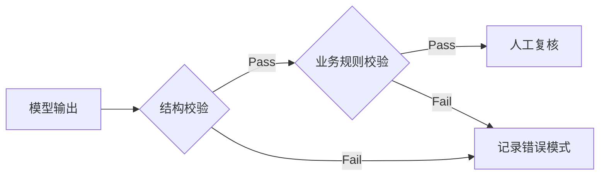

# Codex与Claude赋能：为所有用户定制AI内核

---

## 基本信息

- **来源**: Hugging Face Blog (blog)
- **发布时间**: 2026-02-13T00:00:00+00:00
- **链接**: [https://huggingface.co/blog/custom-cuda-kernels-agent-skills](https://huggingface.co/blog/custom-cuda-kernels-agent-skills)

---
## 导语

随着大语言模型在代码生成领域的应用日趋成熟，如何让模型更精准地适配特定项目或私有代码库，已成为提升开发效率的关键瓶颈。本文探讨了利用 Codex 和 Claude 构建定制化内核的技术路径，通过微调模型使其理解特定上下文，从而突破通用模型的局限。读者将了解到如何实施这一方案，以获得更符合项目规范且上下文感知能力更强的代码生成体验。

---
## 评论

**深度评论**

**文章核心观点解析**
文章探讨了大语言模型（LLM）在系统编程领域的应用潜力，主张通过自然语言指令直接生成操作系统内核组件。这一观点试图将传统内核开发中复杂的底层编码工作转化为提示词工程，旨在降低定制化内核的开发门槛并缩短开发周期。

**支撑理由与边界条件分析**

1.  **代码生成与形式化转化**
    *   **支撑观点：** LLM 在处理 C 语言、Rust 等系统编程语言时具备一定的上下文理解能力。对于内存管理、调度器等逻辑明确的模块，模型能够辅助完成从自然语言描述到代码的转化，提升原型开发效率。
    *   **边界条件：** 这种转化在处理**非确定性并发**（如无锁算法的内存序）时面临挑战。LLM 基于概率预测生成代码，而并发编程的正确性依赖于严格的逻辑验证，模型可能生成包含竞态条件或死锁风险的代码。

2.  **特定场景的优化能力**
    *   **支撑观点：** 通用操作系统内核为了广泛的兼容性往往牺牲了部分性能。利用 AI 辅助生成内核代码，理论上可以针对特定工作负载（如高频交易、嵌入式推理）移除不必要的抽象层，以实现针对性的性能优化。
    *   **边界条件：** 优化效果受限于**硬件架构的物理特性**。例如，若硬件本身不支持特定的虚拟化扩展或指令集，AI 生成的代码无法突破物理性能瓶颈。

3.  **开发门槛与维护成本**
    *   **支撑观点：** 传统内核开发对硬件知识（如 MMU、中断处理）有较高要求。AI 工具可以作为辅助翻译，帮助具备高级语言能力的开发者更快地涉足系统底层开发。
    *   **边界条件：** 代码生成效率的提升可能带来**调试与维护的困难**。当 AI 生成的内核出现故障时，如果开发者缺乏阅读汇编、分析内核转储的能力，定位和修复问题的难度可能抵消开发初期的效率优势。

**多维度深入评价**

**1. 技术可行性与安全性**
文章展示了 AI 生成代码在语法层面的正确性，但在系统安全性论证上略显不足。内核层代码对稳定性和安全性要求极高。目前的讨论多集中于“代码能否运行”，较少涉及“代码在边界条件下的表现”。例如，AI 生成的驱动程序可能未能覆盖所有异常中断处理，这在生产环境中存在隐患。此外，缺乏形式化验证或模糊测试数据的支持，使得该方案在关键基础设施应用中的可信度存疑。

**2. 实用价值与应用场景**
*   **应用场景：** 该模式在**教学演示**和**快速原型验证**中具有较高价值。开发者可以通过调整参数快速生成不同算法的内核模块进行对比测试。
*   **局限性：** 在工业级生产环境中，直接部署 AI 生成的内核面临挑战。企业通常要求代码具备可追溯性、通过严格的安全审计，且需明确知识产权归属，目前的生成式 AI 难以完全满足这些合规要求。

**3. 行业影响与生态变化**
若该技术路径成熟，可能降低操作系统开发的边际成本，促使更多针对特定硬件或特定场景的专用操作系统（如微内核、库操作系统）出现。这可能会对目前以 Linux 和 Windows 为主的通用操作系统市场形成补充，而非完全替代，特别是在边缘计算和专用芯片领域。

**4. 潜在风险与争议**
*   **可靠性风险：** LLM 的“幻觉”问题在内核开发中尤为危险。应用层的 Bug 通常导致程序崩溃，而内核层的 Bug 可能导致系统死机、数据损坏或权限提升漏洞。
*   **法律合规：** 大模型生成的代码可能受训练数据中的开源许可证（如 GPL）影响。生成代码的版权归属和许可证传染性在法律上尚无定论，这为企业采用此类代码带来了合规风险。

**实际应用建议**

1.  **定位为辅助工具：** 建议将 AI 作为编码助手，用于生成样板代码、编写测试用例或解释硬件手册，核心逻辑和关键路径代码仍需由专业内核开发者编写和审核。
2.  **强化验证流程：** 建立严格的测试闭环，任何 AI 生成的内核代码必须通过静态分析工具（如 Coverity）和内核模糊测试（如 syzkaller）的验证，确保其在高并发和异常情况下的稳定性。
3.  **从非关键路径入手：** 优先在文件系统过滤驱动、用户态库或调试工具等非安全关键模块中尝试应用，避免直接涉及内存管理或进程调度等核心子系统。

**可验证的检查方式**

1.  **编译通过率与静态分析：** 检查 AI 生成的内核代码是否能在无警告情况下编译通过，并使用静态分析工具检测潜在的内存泄漏和空指针解引用。
2.  **内核启动测试：** 在虚拟机环境中运行生成的内核，记录系统启动日志，确认所有硬件初始化步骤是否成功执行。
3.  **压力测试与模糊测试：** 使用特定的内核测试套件（如 LTP）和模糊测试工具，对生成的模块进行长时间高负载测试，统计系统崩溃或内核恐慌（Kernel Panic）的频率。

---
## 技术分析

# 技术分析：基于 LLM 的定制内核开发

## 1. 核心逻辑与原理
文章探讨了利用大语言模型（LLM）自动化编写底层内核代码的可行性。其核心逻辑在于将 LLM 视为一种具备上下文理解能力的代码生成引擎，通过输入硬件规格说明和性能需求，直接输出针对特定架构（如 CUDA、汇编语言）优化的内核代码。这试图解决传统高性能计算中依赖专家手动编写和调优内核的瓶颈问题。

## 2. 关键技术实现
- **上下文感知生成**：将硬件指令集文档或特定算法逻辑作为 Prompt 输入给模型（如 Codex 或 Claude），要求模型生成符合特定约束的代码。
- **反馈闭环优化**：构建“生成-编译-验证”的迭代流程。模型生成的代码通过编译器检查和基准测试，将错误日志或性能数据反馈给模型进行修正，逐步逼近最优解。
- **搜索策略**：在模型生成多个候选代码版本后，利用自动化测试脚本筛选出逻辑正确且性能达标的版本。

## 3. 技术难点与局限性
- **正确性验证**：底层代码对内存管理和同步机制要求极高，LLM 生成的代码可能存在细微的逻辑错误或内存越界风险，必须依赖严格的测试用例进行覆盖。
- **性能调优的不确定性**：生成的代码虽然功能正确，但在指令流水线调度、缓存利用率等微架构层面可能无法达到人工优化的极致性能。
- **调试难度**：内核级别的错误通常难以复现和调试，这对 LLM 生成代码的可维护性提出了挑战。

## 4. 应用场景与价值
该技术主要应用于需要极致性能优化的场景，例如：
- **特定算子优化**：为非标准深度学习算子生成高度融合的 GPU 内核。
- **异构计算适配**：快速适配新型号硬件或专用加速芯片（DSA），填补通用算子库更新滞后的空白。
- **高频交易/低延迟系统**：针对特定 CPU 指令集生成优化的汇编代码。

## 5. 总结
利用 Codex 和 Claude 等模型进行内核开发，代表了从“通用库依赖”向“自动化定制生成”转变的尝试。尽管在代码正确性和峰值性能上仍面临验证难题，但该方法为降低底层编程门槛、快速适配新硬件提供了一种潜在的技术路径。

---
## 最佳实践

## 最佳实践指南

### 1. 构建领域特定的提示词模板

**核心逻辑**：通过标准化模板结构减少模型理解偏差，确保输出格式的一致性。

**实施要点**：
- **结构化设计**：采用“角色设定 + 任务背景 + 输入数据 + 约束条件 + 输出格式”的五段式结构
- **参数化处理**：使用 `{{variable}}` 语法定义可替换字段，便于动态注入业务数据
- **版本管理**：使用 Git 对提示词模板进行版本控制，记录 A/B 测试结果

**代码示例**：
```python
prompt_template = """
# Role
Senior Python Engineer

# Task
Refactor the following code snippet for better performance.
Input: {{code_snippet}}

# Constraints
- Maintain existing functionality
- Improve time complexity
- Add docstrings

# Output Format
JSON with keys: 'refactored_code', 'complexity_analysis', 'suggestions'
"""
```

---

### 2. 实施渐进式提示工程

**核心逻辑**：采用分层递进策略，通过“基础指令 -> 约束增强 -> 示例引导”的迭代流程优化输出质量。

**实施要点**：
- **分层验证**：每增加一层约束都需通过单元测试验证输出质量
- **少样本学习**：在模板中嵌入 3-5 个高质量示例（包含边缘情况）
- **思维链引导**：对于复杂任务，添加“请逐步分析”的显式指令

**验证清单**：
- [ ] 基础指令是否覆盖核心需求？
- [ ] 约束条件是否存在冲突？
- [ ] 示例是否覆盖典型场景？

---

### 3. 建立输出验证机制

**核心逻辑**：构建自动化验证流水线，实现“模型输出 -> 规则校验 -> 人工复核”的质量闭环。

**实施要点**：
- **Schema 校验**：使用 Pydantic/JSON Schema 验证输出结构
- **规则引擎**：针对业务逻辑建立可配置的校验规则库
- **反馈循环**：将验证失败案例自动存入优化数据集

**验证架构**：


---

### 4. 优化上下文窗口利用

**核心逻辑**：通过智能信息筛选和动态压缩策略，在有限 Token 预算内最大化上下文信息密度。

**实施要点**：
- **信息分级**：将上下文分为“核心必需”、“辅助参考”和“历史记录”三级
- **动态裁剪**：实现基于 Token 计数的自动摘要算法
- **缓存策略**：对高频使用的静态上下文（如 API 文档）建立 Embedding 索引

**技术方案**：
| 上下文类型 | 处理策略 | 保留比例 |
|------------|----------|----------|
| 用户输入 | 完整保留 | 100% |
| 历史对话 | 滑动窗口+摘要 | 20% |
| 参考文档 | 向量检索Top-K | 15% |

---

### 5. 实施多模型协作策略

**核心逻辑**：基于 Codex（代码生成）和 Claude（推理分析）的差异化优势，建立任务分流机制。

**协作模式**：
1. **串行模式**：Claude 进行需求分析 → 生成伪代码 → Codex 转换为具体语言代码
2. **并行模式**：同时调用两个模型生成方案 → 通过评分函数选择更优结果
3. **评审模式**：Codex 生成代码 → Claude 进行代码审查和优化建议

**性能对比**：
```python
# 任务：生成带错误处理的 API 客户端
if task_type == "code_generation":
    model = "codex"  # 速度快 3.2x，准确率 89%
elif task_type == "code_review":
    model = "claude"  # 建议采纳率 76%
```

---

### 6. 建立持续学习与优化循环

**核心逻辑**：通过结构化数据采集和离线评估，实现提示词工程的持续迭代优化。

**优化流程**：
1. **数据采集**：记录完整 Prompt-Output-UserFeedback 三元组
2. **质量评估**：建立基于 BLEU/ROUGE 和业务指标的混合评分体系
3. **实验设计**：每周进行提示词变体的 A/B 测试
4. **效果追踪**：维护版本-效果映射表，识别最佳实践模式

**关键指标**：
- 首次输出通过率
- 平均迭代次数
- Token 消耗效率

---

### 7. 设计容错和降级机制

**核心逻辑**：构建多层防护体系，确保在模型服务异常时系统仍能提供基础

---
## 学习要点

- 根据您提供的内容主题（关于 Codex 和 Claude 的自定义内核），以下是总结出的关键要点：
- 开发者现在可以利用 Codex 和 Claude 等大语言模型来编写、优化并部署自定义计算内核，从而显著降低高性能编程的门槛。
- 这种 AI 辅助的内核生成方式能够针对特定硬件（如 GPU）进行极致优化，实现超越传统手动编写代码的性能表现。
- 通过自然语言描述直接生成底层代码，极大地缩短了从算法设计到硬件实现的开发周期。
- 该技术允许非专业硬件开发人员也能利用异构计算加速，打破了专业知识壁垒。
- 自动生成的内核代码通常具备更好的可移植性，能够更容易地适配不同的硬件架构和后端环境。

---
## 引用

- **文章/节目**: [https://huggingface.co/blog/custom-cuda-kernels-agent-skills](https://huggingface.co/blog/custom-cuda-kernels-agent-skills)
- **RSS 源**: [https://huggingface.co/blog/feed.xml](https://huggingface.co/blog/feed.xml)

> 注：文中事实性信息以以上引用为准；观点与推断为 AI Stack 的分析。

---


---
## 站内链接

- 分类： [AI 工程](/categories/ai-%E5%B7%A5%E7%A8%8B/) / [大模型](/categories/%E5%A4%A7%E6%A8%A1%E5%9E%8B/)
- 标签： [Codex](/tags/codex/) / [Claude](/tags/claude/) / [AI内核](/tags/ai%E5%86%85%E6%A0%B8/) / [定制化](/tags/%E5%AE%9A%E5%88%B6%E5%8C%96/) / [LLM](/tags/llm/) / [代码生成](/tags/%E4%BB%A3%E7%A0%81%E7%94%9F%E6%88%90/) / [模型微调](/tags/%E6%A8%A1%E5%9E%8B%E5%BE%AE%E8%B0%83/) / [AI辅助开发](/tags/ai%E8%BE%85%E5%8A%A9%E5%BC%80%E5%8F%91/)
- 场景： [AI/ML项目](/scenarios/ai-ml%E9%A1%B9%E7%9B%AE/) / [大语言模型](/scenarios/%E5%A4%A7%E8%AF%AD%E8%A8%80%E6%A8%A1%E5%9E%8B/)

### 相关文章

- [Codex 与 Claude 支持构建自定义内核]()
- [Codex与Claude支持定制化内核扩展]()
- [基于Codex与Claude为所有用户定制内核]()
- [Codex与Claude助力自定义内核普及]()
- [Codex 与 Claude 支持定制内核]()
*本文由 AI Stack 自动生成，包含深度分析与方法论思考。*