# AI Stack 统一拓扑与检索排版设计验收

验收日期：2026-07-18
验收分支：`codex/graph-ui-refresh`

目标：以用户提供的赛博社区拓扑截图与已验收的「02 标签社区」为视觉真值，将 `/scenarios/` 的「01 技术总览」「02 标签社区」「03 节点邻域」及 `/trends/` 的「趋势矩阵」统一为同一套空间语言；同时让 `/search/` 的字体层级回归全站尺度，并保留真实数据、分层加载、共享 Header 与移动端可用性。

## 同视口视觉对照

参考图与社区详情实现均为 1625×968，状态均为“中心社区已展开 + 右侧详情可见”。两张图已在同一次图像对照中检查。

| 参考视觉 | 最终社区实现 |
| --- | --- |
|  |  |

最终实现保留并统一了参考图的关键视觉语法：深蓝星场、外围青色聚类细胞、中心琥珀展开态、有机等高线、虚线语义路径、矩形终端标签、左侧工作台和右侧证据抽屉。

以下差异属于真实产品约束：

- 顶部继续使用全站唯一共享 Header，避免图谱页成为孤立视觉系统。
- 节点名、文章数、连接数、趋势得分与来源均来自当前静态数据，不复刻演示数字。
- 社区与邻域采用可读性预算，不一次绘制全量 7,000+ 节点和 50,000+ 连线。

### 本轮同视口比较：标签社区 → 技术总览

本轮在同一浏览器、同一 1688×1050 视口中同时打开以下两张完整页面截图，并放入同一次图像比较输入中检查，而不是分别凭印象判断：

- 视觉源：`tmp/qa/community-reference-local.png`
- 实现：`tmp/qa/overview-after-desktop-v2.png`

比较结论：技术总览已复用标签社区的星场密度、等高线细胞、青色外围/琥珀中心、终端标签和虚线语义路径；差异仅来自总览的真实数据结构——总览只有 5 个技术层，社区有 11 个社区。总览没有为了接近截图而伪造额外社区或连线。

焦点复核还覆盖：

- 1280×720：5 个技术域完整可见，中心模型域与四个外围域层级明确。
- 390×844：无横向溢出，5 个聚类细胞、标签与工具条不互相遮挡。
- 156% 缩放：节点、等高线、聚合路径和箭头同步缩放；场域没有与节点脱节。
- 图层筛选：关闭语言层后真实遥测从 69/71 更新为 61/55。
- 键盘搜索：`API` 返回 10 条分层结果，Enter 进入 25 节点/24 连线邻域，Esc 清除详情并回到 69/71 总览。

### 本轮检索归档排版比较

`/search/` 使用全站共享字体令牌：标题 30px/36px、正文 14px、桌面控件 13px、移动端输入控件 16px；所有控件高度至少 44px。桌面 1688px 与移动端 390px 的 `scrollWidth` 均等于 `clientWidth`，无横向溢出。CSS 与 JS 使用同一内容指纹，避免滚动发布时新旧资产错配；占位文字提升到 62% 明度。

- 来源、实体、标签与场景统一使用深色赛博 `combobox/listbox`，保留原生控件作为无脚本兜底；桌面与 390×844 视口均不会弹出脱离主题的系统白色菜单。
- 来源控件首次点击即可按需加载 Pagefind facet；生产构建实测选择 `arxiv` 后只返回对应结果，过滤状态、结果计数与底层原生值保持同步。
- 自动补全在中文输入法合成期间不抢占 Enter，也不会重绘候选；候选确认后再进行大小写无关的近似匹配。

## 三个核心场景

| 标签社区 | 节点邻域 | 趋势矩阵 |
| --- | --- | --- |
|  |  |  |

### 02 标签社区

- 社区摘要返回后立即绘制 11 个真实社区细胞；默认热点分片在后台按需加载，不阻塞第一层画面。
- 热点展开后为中心琥珀真实网络，外围保持青色社区细胞；最新线上数据实测 25 节点、80 连线。
- 打开详情时布局预留右侧通道；关闭、背景点击或 Esc 后恢复全舞台，重排可逆且只执行一次。
- v1 或缺少社区摘要的数据自动回退到有界同心布局，不会叠成一个点。

### 03 节点邻域

- 从旧的长放射辐条改为“中心 1-hop 展开 + 最多 6 个外围关系细胞”，与社区页使用相同等高线、标签和路径语法。
- 当前实测 25 节点、24 连线；中心最多 8 个强邻居，其余上下文按真实社区、类别和图层分组。
- 节点尺寸、颜色和标签层级受控；琥珀仅表示当前焦点，外围保持青色，避免旧版大圆点与交叉长线。

### 趋势矩阵

- 首屏最多显示 11 个真实趋势细胞；选中主题进入中心固定放大展开态，五档辉光强度与圈层编码综合热度，外围圈径编码证据量。
- 中心内部节点只使用真实来源与场景；常态标签仅显示全窗口真实排名、主题和信号状态，悬停后才展示得分、证据和来源，筛选不会重新编号。
- 空间位置仅表达主题分组与排名轨道，不伪装成增长率 × 证据量的笛卡尔坐标。
- 主题选择写入 URL，并可继续下钻到文章证据和 `/scenarios/?mode=focus&node=...` 知识图谱。

## 移动端与全站一致性

| 社区 390×844 | 邻域 390×844 | 趋势 390×844 |
| --- | --- | --- |
|  |  |  |

- 三个页面复用同一 Header、品牌字体、导航、青绿状态色与少量琥珀选中态。
- 390×844 无水平溢出；图谱使用紧凑聚类槽位，趋势页自动使用可访问列表而不绘制不可见 Canvas。
- 触控按钮保持至少 44px；详情在窄屏使用文档流或底部区域，不遮挡主要控制。
- 动态文案使用安全文本路径；键盘状态、ARIA 标签、详情关闭与 URL 恢复均可用。

## 性能与可靠性

- 图谱坚持分层加载：核心图 → 社区摘要 → 单个热点或节点邻域分片；无全量主线程绘制。
- 趋势 Canvas 只有尺寸、筛选、悬停或选择变化时重绘，无持续 `requestAnimationFrame`；backing store 复用并限制为 8 Mi 像素预算。
- 图谱场域 Canvas 同样按需单帧绘制；粒子只沿高亮路径运行，并受数量、页面可见性和 `prefers-reduced-motion` 约束。
- 主题缓存命中会先取消并失效旧请求，迟到响应不能覆盖新选择；社区后台分片也具有取消和序列防护。
- 浏览器实测社区、邻域、趋势选择与移动端页面 console error/warning 均为 0。
- 首页终端命令经过 NFKC、大小写与中文输入法碎片归一化；`l s` 可安全恢复为 `ls`，合成期间 Enter 不会提前执行，未知命令提交后输入不会累积污染下一条命令。

## 对照迭代历史

- Pass 1：社区首次进入被迟到的 `cy.ready` 缩到 66%；邻域仍是长放射辐条；趋势矩阵仍是传统气泡图。修复为确定性 100% 语义场景与三页统一拓扑。
- Pass 2：社区默认展开仍阻塞摘要；趋势缓存存在晚到覆盖，Canvas 悬停会重复分配 backing store。修复为真正渐进加载、请求序列失效和像素预算。
- Pass 3：社区详情预留在真实调用顺序下不可逆，v1 community 会堆叠；趋势筛选排名和圈径说明不一致。补齐状态机、降级布局、真实排名与准确图例。
- Pass 4：同一视口比较参考与实现，复核 Header、字重、边距、标签清晰度、星场密度、等高线、中心/外围层级、抽屉遮挡和移动端溢出；未发现剩余可见偏差或阻断问题。
- Pass 5：技术总览仍是 Dagre 列式大圆点网络，与社区空间语言割裂。改为 5 个真实技术层的确定性聚类场，并把 71 条真实边聚合为 5 条层间流。
- Pass 6：关闭图层后遥测仍显示旧计数；检索页在旧 `style.css` 缓存下 CSS 变量失效。补齐可见集合统计、旧缓存 fallback、CSS/JS 同版本指纹、移动端 16px 输入与占位文字对比度。
- Pass 7：独立审查发现缩放事件会重复遍历节点并重写整组遥测。缩放事件改为只更新百分比；可见统计只在模式、图层、密度或数据变化时刷新。最终 P0/P1/P2 均为 0。

## 最终验证

- Node：125 tests passed。
- Python 3.12（使用本轮生产构建产物执行 E2E）：1,042 passed，85 subtests passed。
- Hugo 0.153.4：2,535 页生产构建通过；`/scenarios/`、`/trends/` 与首页产物存在。
- Pagefind 与安全结果目录：2,142 篇文章、33,376 个词，catalog 与 manifest 构建通过。
- 图谱、趋势、历史内容质量清单与静态数据哈希验证通过。
- JS 语法、`git diff --check` 与差异密钥模式扫描通过。
- In-app Browser：模式切换、图层筛选、键盘检索、邻域下钻、Esc 复位、缩放、390×844 和 console error/warning 均通过。
- 两轮独立只读复核：P0 0、P1 0、P2 0。

## 趋势筛选与热度增强（2026-07-18）

- 原生系统弹层已替换为渐进增强的赛博 `combobox/listbox`：深色实底、青色选中轨、等宽数量、44px 触控行；脚本不可用时仍保留原生 `select` 兜底。
- 三个下拉支持点击外部关闭、Esc 取消、上下键、Home/End、Enter/Space、首字符定位与 Tab 退出；动态来源/场景、清除筛选和浏览器历史恢复都会同步当前值。
- 场景选项同时显示“主题数 / 证据数”；切换 24 小时、7 天、30 天时会重新校验当前场景，窗口中不存在的筛选会从状态与 URL 一并移除，避免看似已筛选但数据未变化。
- 综合热度使用固定五档（低热、观察、活跃、高热、强信号），跨时间窗口可比较；热度用等级文案、辉光和环数表达，证据量继续控制圈径，`✦ / ↑ / • / ↓` 单独表达变化状态。
- 首屏仍限制 11 个主题、Canvas 仍限制 8MP，无粒子或持续动画；选择框仅 3 个控制器，动态选项采用事件委托，不改变趋势数据 schema 或生成链路。
- 浏览器实测 1280×720 与 390×844：菜单未溢出视口，键盘选择仅触发一次筛选，Esc 不改值，外部点击关闭；移动端使用文本热度等级，即使矩阵隐藏也不依赖颜色理解信号。

## 趋势拓扑标签、悬停与全节点光场（2026-07-18）

| 常态全节点光场 | 悬停得分面板 |
| --- | --- |
| 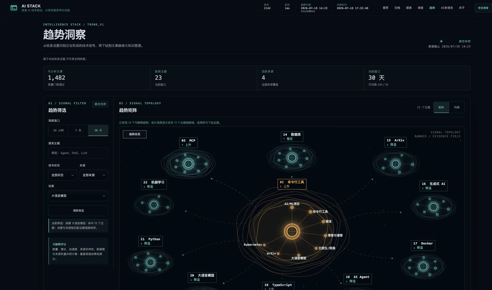 | 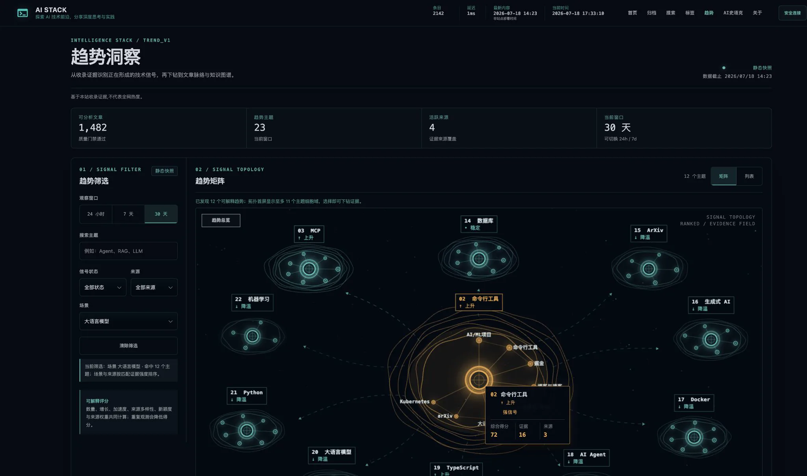 |

参考截图与最终 Canvas 已裁切为相同的 1812×1080 图谱视域，并放入同一张纵向比较图检查节点尺寸、光晕、标签负载、等高线、中心/外围层级与路径密度：

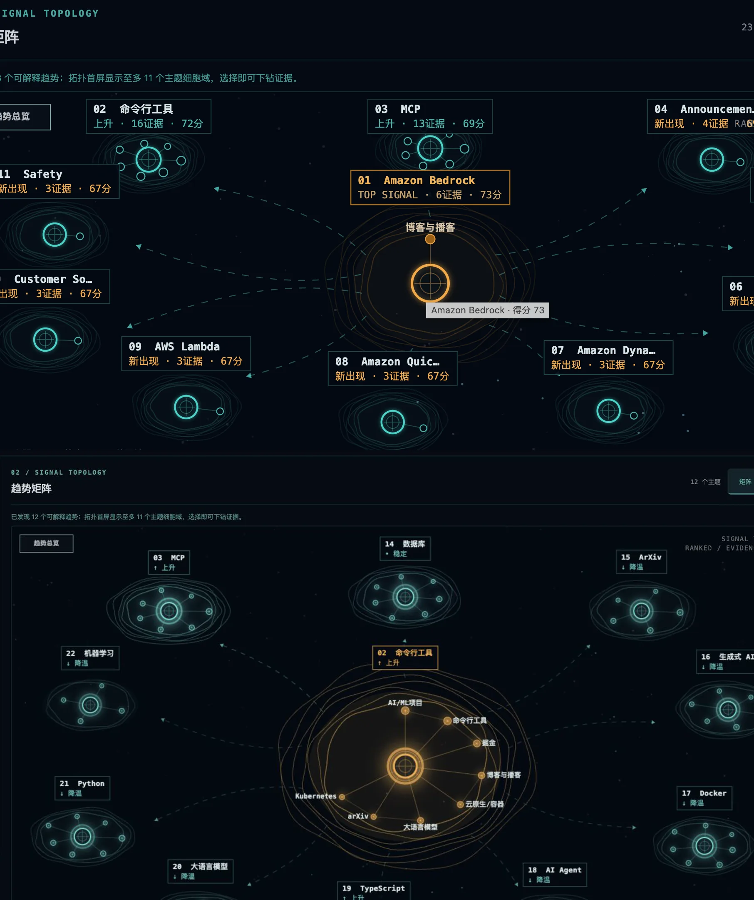

- 常态终端标签收敛为两行：`排名 + 主题`、`✦ 新出现 / ↑ 上升 / • 稳定 / ↓ 降温`；不再永久显示得分、证据或 `TOP SIGNAL`。
- 悬停使用深色赛博提示层展示综合得分、证据数和来源数，替代不可控的浏览器白色原生 `title` 提示；文本继续通过安全 DOM 路径构建。
- 所有外围主节点与子节点常驻青色光场，热度只控制辉光强弱与圈层数量；中心或当前焦点使用琥珀色，避免低热节点灰成“未激活”。
- 光感由可缩放的径向光场、描边阴影和子节点内核三层组成；主节点模糊上限 44px、子节点 18px、光场半径 55px，最多 11 个主题细胞且只在数据、尺寸或交互状态变化时单帧重绘。
- 实测当前筛选场景中所有可见主节点和内部子节点均有光感；悬停中心节点显示“命令行工具 / 上升 / 72 分 / 16 证据 / 3 来源”，常态画面不再出现信息过载。
- Pass 8：同视域复核发现低热节点在 DPR=2 与截图缩放后光晕衰减、外圈高分节点可能误用琥珀色。补充径向光场与内核光，外围统一青色、中心保留琥珀色，并锁定绘制预算；P0/P1/P2 均为 0。

## 趋势页共享排版尺度（2026-07-21）

- source visual truth path: `docs/assets/design-qa/trend-typography-reference-2016.webp`
- implementation screenshot path: `docs/assets/design-qa/trend-typography-after-2016.webp`
- before screenshot path: `docs/assets/design-qa/trend-typography-before-2016.webp`
- viewport: 2016×951；自动化响应式检查另覆盖 1440×900、1440×901、390×844、844×390 触控横屏。
- state: 深色主题、共享站点头部、趋势 30 天窗口、矩阵视图、数据加载完成。

同一视口并排检查检索页与趋势页后，趋势页已复用全站排版尺度：页面标题 30px/36px、字重 300，说明文字 14px，模块标题 18px，控件 13px，11px 仅用于排名、证据数和终端元信息。标题、说明、KPI、筛选控件和模块标题在原始截图中均可辨认，因此不需要额外裁切；计算样式测试补充验证精确值。

| 全站排版参照 | 修复前趋势页 | 修复后趋势页 |
| --- | --- | --- |
| 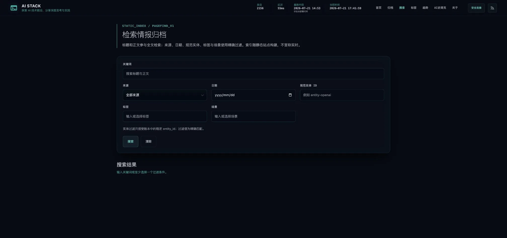 | 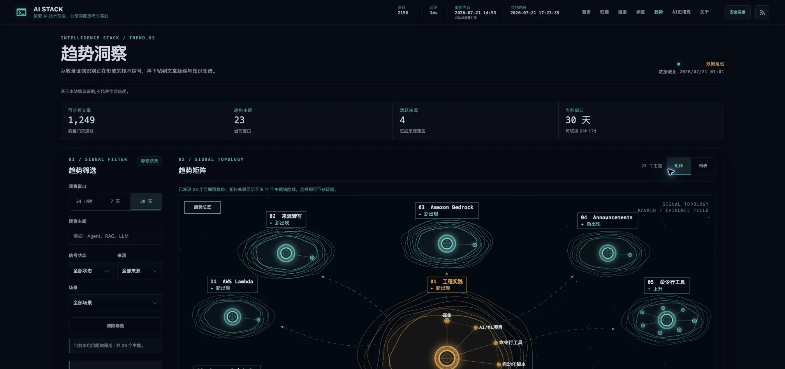 | 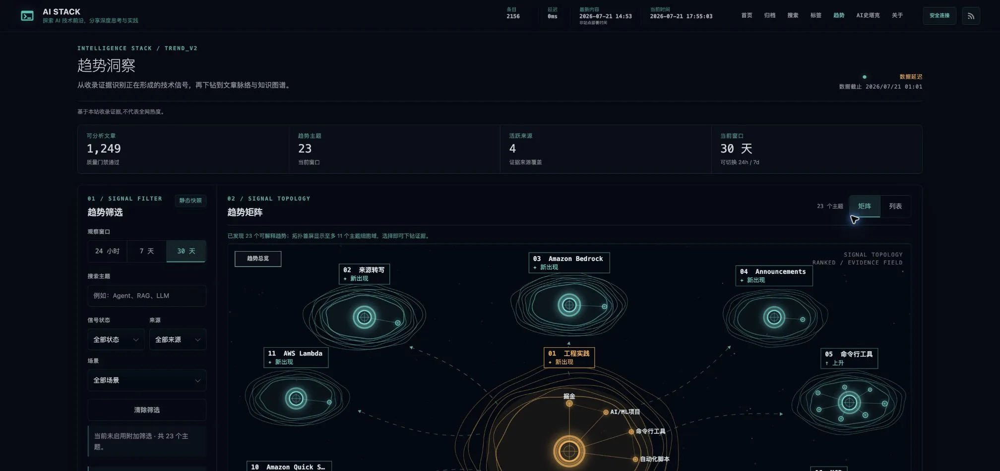 |

### 本轮对照迭代

- Pass 9：趋势标题原为 28–44px、字重 520，与检索/列表页 30px、字重 300 不一致；正文与控件又大量使用 11–12px。现已改用 `--site-page-title-size`、`--site-page-title-line-height`、`--site-copy-size` 和 `--site-control-size`。
- Pass 10：独立审查发现 900/901px 高度断点仍改变说明文字行高，横屏触控视口仍可能以 13px 聚焦输入。现只压缩外部间距，文字行高保持共享值；coarse pointer 输入固定 16px，避免移动 Safari 自动缩放。

### 必查表面与验证

- 字体：通过；标题、正文、控件、模块与 meta 五级尺度稳定。
- 间距：通过；未改变工作台网格、节点预算或面板尺寸。
- 颜色：通过；继续使用全站深蓝、青绿、灰白与琥珀状态色。
- 图片：不适用；未新增或替换图片资产，Canvas 图谱保持原实现。
- 文案：通过；未改变动态数据、标签或说明语义。
- 响应式与可访问性：通过；触控输入 16px，按钮至少 44px，reduced-motion 和键盘交互未受影响。
- 生产边界：Hugo 0.153.4 构建、Pagefind、图谱/趋势/lineage 固定点、91 个 Node 测试、41 个交付测试与 11 个浏览器 E2E 全部通过；页面运行时异常为 0。

本轮未遗留 P0/P1/P2 项。

final result: passed

## 情报账本全站重构与图谱字体复核（2026-07-22）

- source visual truth path: `docs/assets/design-qa/site-redesign-reference-option-1.png`
- implementation screenshot path: `docs/assets/design-qa/site-redesign-implementation-posts.png`
- graph implementation screenshot path: `docs/assets/design-qa/site-redesign-implementation-graph.png`
- comparison path: `docs/assets/design-qa/site-redesign-comparison-option-1.png`
- comparison viewport: 1280×720；参考稿按宽度等比缩放后取相同首屏视域，未拉伸。

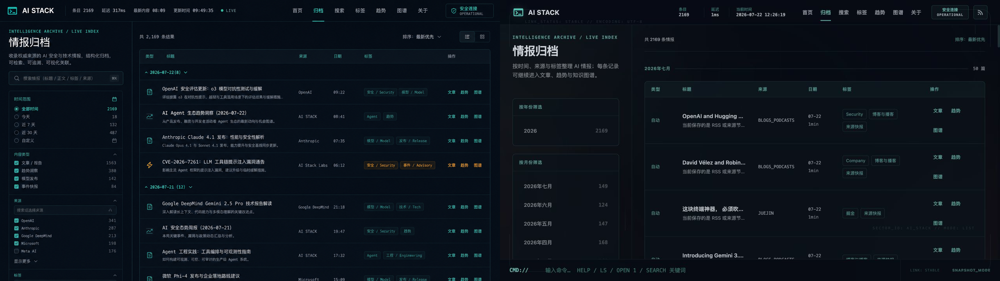

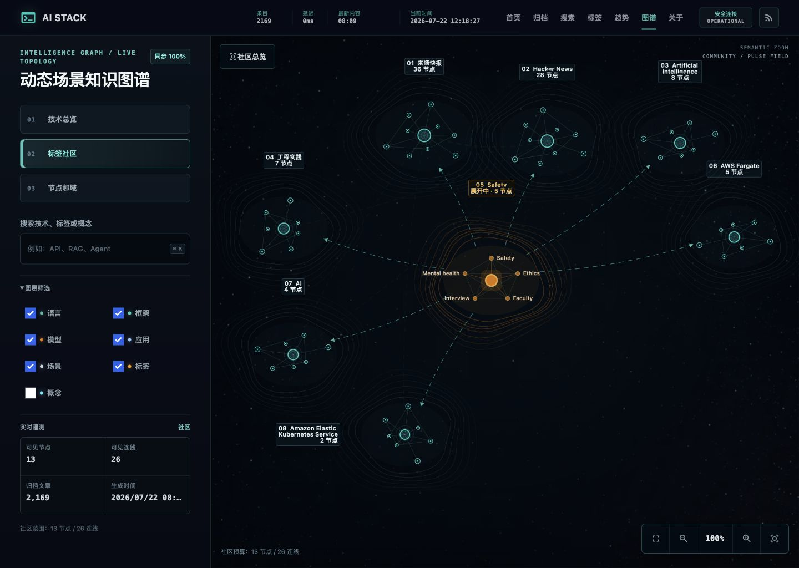

### 字体职责

- 中文页面标题、菜单、筛选项、节点名、详情说明与文章条目统一使用共享 Sans；Mono 仅用于编号、时间、数量、状态、英文 kicker 与终端命令。
- 页面标题统一为 30px / 1.2 / 600，模块标题、正文、控件与元信息继续复用全站语义令牌；图谱标题不再维护第二套字号或字重。
- 图谱 Canvas 的普通、紧凑与特征节点分别使用 12px、10px、11px，统一字重为 500/600；屏幕字号低于 10px 时直接隐藏标签，避免缩放后出现 6–9px 的模糊 CJK 字形。
- 图谱实时状态与英文 kicker 放在独立元信息行，标题获得完整栏宽；“同步 100%”不会再挤压标题换行。

### 同视域复核

- 参考与实现保持同一 64px 顶栏、紧凑左轨、深蓝底、青绿强调、细分隔线与高密度账本结构。
- 图谱的技术总览、标签社区与节点邻域三态均复核；节点详情、模式浮标、检索与图层筛选未出现 Mono 泄漏或标题换行。
- 归档页的标题、表头、条目、来源、日期、标签与操作建立清晰层级；默认日志层关闭后首屏无内容遮挡。
- P0/P1/P2：0 / 0 / 0。

final result: passed

## 全站子模块字体系统（2026-07-21）

> 历史验收记录：该轮仍保留 22px 工作台标题与 Canvas 字体例外；最终状态已由上方 2026-07-22“情报账本全站重构与图谱字体复核”覆盖。

本轮将首页、Posts、时间线归档、搜索、标签、趋势、知识图谱、About、场景详情与文章内的溯源模块放入同一排版契约。桌面对照均为 1280×720，比较图上半部分为修改前、下半部分为修改后；移动端统一使用 390×844。

| 标签目录 | About | 图谱工作台 |
| --- | --- | --- |
| 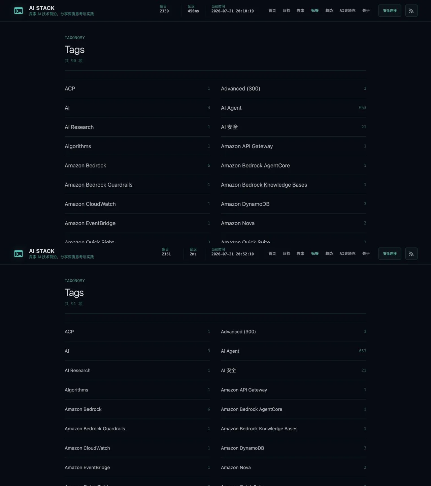 | 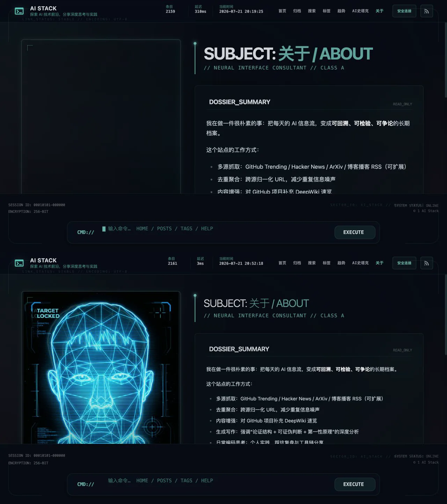 | 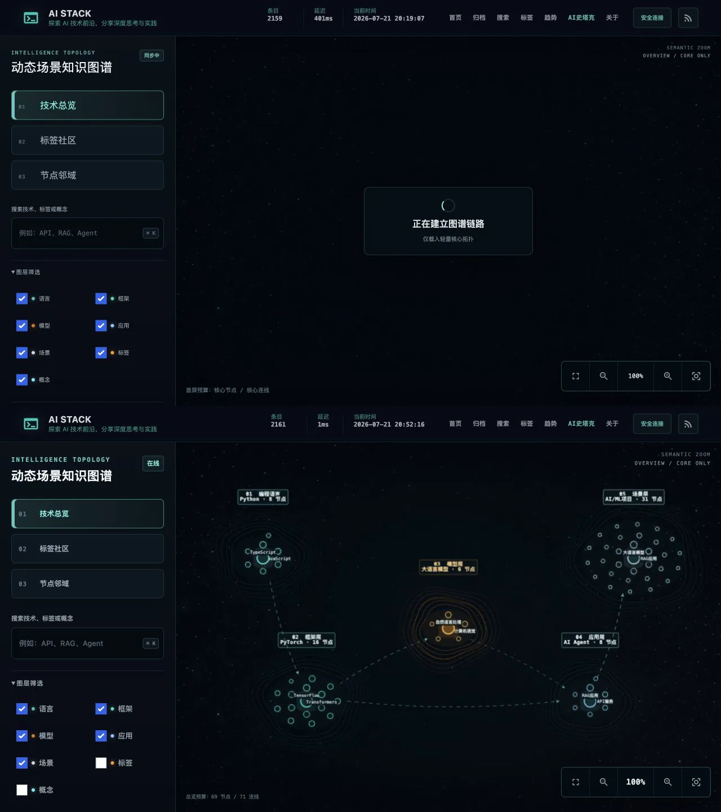 |

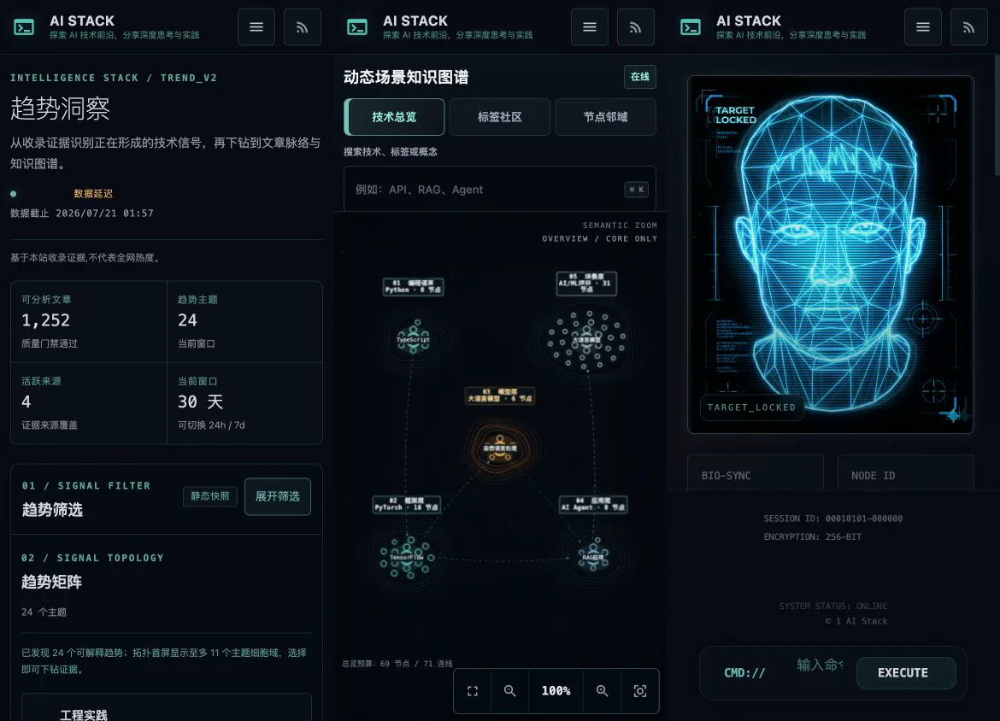

### 统一后的语义标尺

- 普通页面标题：30px / 1.2 / 300；首页、Posts、Archive、Search、Tags、About、趋势与场景详情共享同一语义类。
- 工作台标题：桌面 22px、移动端 18px / 1.25 / 600；用于知识图谱这类高密度操作界面。
- 模块标题：18px / 1.35 / 600；搜索结果、趋势面板、图谱详情、About 模块和文章内功能模块一致。
- 正文：14px / 1.75；控件：13px / 1.5 / 600；元信息：11px / 1.45；主要 KPI：22px，紧凑指标：14px。
- Sans 与 Mono 均由 `style.css` 的共享变量唯一提供；Tailwind 工具类不再维护第二套字体栈。

### 保留的合理例外

- 文章标题与 18px 阅读正文维持编辑阅读尺度，不被工具页 14px 基线压缩。
- Cytoscape/Canvas 标签继续受碰撞与缩放预算控制；本轮只统一 DOM 标题、按钮、筛选器、详情抽屉和遥测。
- 9px 只允许用于不可交互的画布模式/容量提示；触控输入保持 16px，避免移动浏览器聚焦缩放。

### 修复与验证

- 修复图谱 `.graph-body button, input { font: inherit; }` 高特异性规则覆盖组件字号的问题，改用低特异性 `:where()` reset。
- 标签目录条目由浏览器回退 16px 收口为 14px；About 从 48px/700 的孤立视觉标题恢复为可见的 30px `h1`；首页卡片标题不再小于正文。
- 搜索、趋势和 lineage 的标题、按钮、摘要、状态与指标均引用共享 token；lineage 不再引用未定义的 `--font-mono`。
- 新增静态字体契约与跨页计算样式 E2E：9 个静态契约、7 个普通页面标题、趋势全部筛选控件，以及图谱桌面/触控输入与工作台标题均有精确断言。
- 全局 `tailwind.css`、`style.css` 与文章 `lineage.css` 使用真实内容哈希版本，避免滚动部署时新模板命中旧字体 CSS。
- Hugo 0.153.4 生产构建、Pagefind 2,161 页索引、91 个 Node 测试、41 个交付测试、45 个定向 Python 测试与 12 个浏览器 E2E 通过；桌面和 390×844 视觉检查未发现截断、横向溢出或控件缩小。

本轮未遗留 P0/P1/P2 项。

final result: passed
