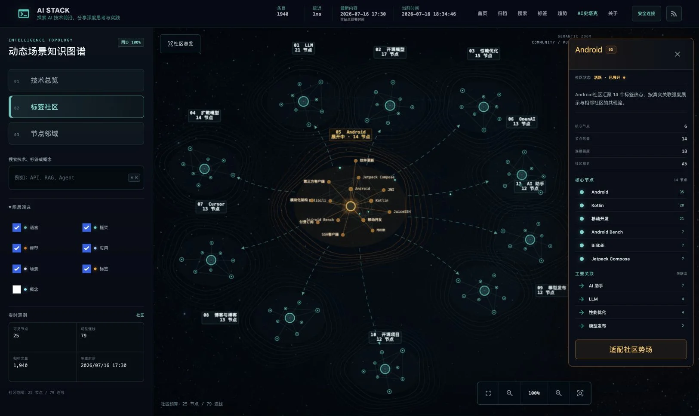
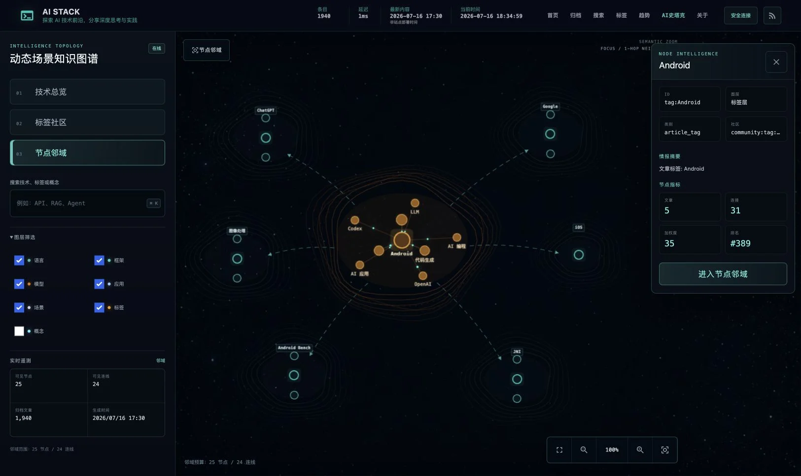
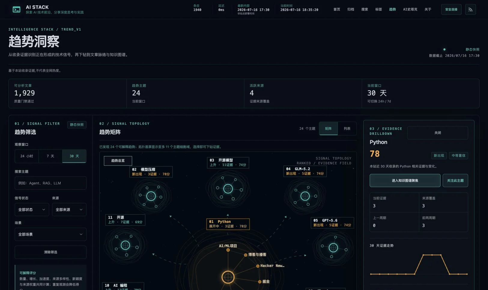
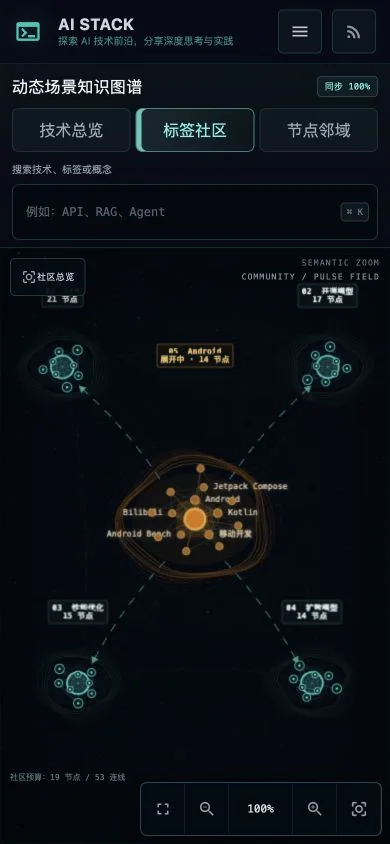
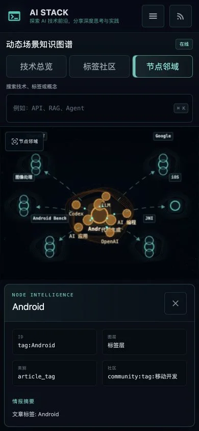
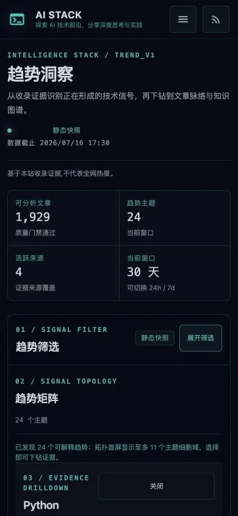
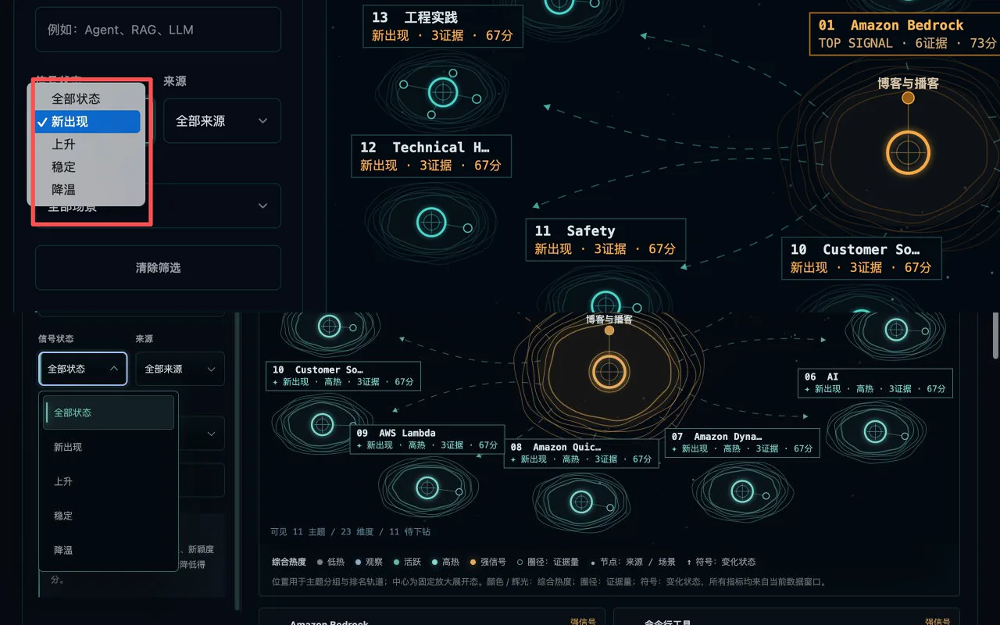

# AI Stack 统一拓扑与检索排版设计验收

验收日期：2026-07-18
验收分支：`codex/graph-ui-refresh`

目标：以用户提供的赛博社区拓扑截图与已验收的「02 标签社区」为视觉真值，将 `/scenarios/` 的「01 技术总览」「02 标签社区」「03 节点邻域」及 `/trends/` 的「趋势矩阵」统一为同一套空间语言；同时让 `/search/` 的字体层级回归全站尺度，并保留真实数据、分层加载、共享 Header 与移动端可用性。

## 同视口视觉对照

参考图与社区详情实现均为 1625×968，状态均为“中心社区已展开 + 右侧详情可见”。两张图已在同一次图像对照中检查。

| 参考视觉 | 最终社区实现 |
| --- | --- |
|  |  |

最终实现保留并统一了参考图的关键视觉语法：深蓝星场、外围青色聚类细胞、中心琥珀展开态、有机等高线、虚线语义路径、矩形终端标签、左侧工作台和右侧证据抽屉。

以下差异属于真实产品约束：

- 顶部继续使用全站唯一共享 Header，避免图谱页成为孤立视觉系统。
- 节点名、文章数、连接数、趋势得分与来源均来自当前静态数据，不复刻演示数字。
- 社区与邻域采用可读性预算，不一次绘制全量 7,000+ 节点和 50,000+ 连线。

### 本轮同视口比较：标签社区 → 技术总览

本轮在同一浏览器、同一 1688×1050 视口中同时打开以下两张完整页面截图，并放入同一次图像比较输入中检查，而不是分别凭印象判断：

- 视觉源：`tmp/qa/community-reference-local.png`
- 实现：`tmp/qa/overview-after-desktop-v2.png`

比较结论：技术总览已复用标签社区的星场密度、等高线细胞、青色外围/琥珀中心、终端标签和虚线语义路径；差异仅来自总览的真实数据结构——总览只有 5 个技术层，社区有 11 个社区。总览没有为了接近截图而伪造额外社区或连线。

焦点复核还覆盖：

- 1280×720：5 个技术域完整可见，中心模型域与四个外围域层级明确。
- 390×844：无横向溢出，5 个聚类细胞、标签与工具条不互相遮挡。
- 156% 缩放：节点、等高线、聚合路径和箭头同步缩放；场域没有与节点脱节。
- 图层筛选：关闭语言层后真实遥测从 69/71 更新为 61/55。
- 键盘搜索：`API` 返回 10 条分层结果，Enter 进入 25 节点/24 连线邻域，Esc 清除详情并回到 69/71 总览。

### 本轮检索归档排版比较

`/search/` 使用全站共享字体令牌：标题 30px/36px、正文 14px、桌面控件 13px、移动端输入控件 16px；所有控件高度至少 44px。桌面 1688px 与移动端 390px 的 `scrollWidth` 均等于 `clientWidth`，无横向溢出。CSS 与 JS 使用同一内容指纹，避免滚动发布时新旧资产错配；占位文字提升到 62% 明度。

- 来源、实体、标签与场景统一使用深色赛博 `combobox/listbox`，保留原生控件作为无脚本兜底；桌面与 390×844 视口均不会弹出脱离主题的系统白色菜单。
- 来源控件首次点击即可按需加载 Pagefind facet；生产构建实测选择 `arxiv` 后只返回对应结果，过滤状态、结果计数与底层原生值保持同步。
- 自动补全在中文输入法合成期间不抢占 Enter，也不会重绘候选；候选确认后再进行大小写无关的近似匹配。

## 三个核心场景

| 标签社区 | 节点邻域 | 趋势矩阵 |
| --- | --- | --- |
|  |  |  |

### 02 标签社区

- 社区摘要返回后立即绘制 11 个真实社区细胞；默认热点分片在后台按需加载，不阻塞第一层画面。
- 热点展开后为中心琥珀真实网络，外围保持青色社区细胞；最新线上数据实测 25 节点、80 连线。
- 打开详情时布局预留右侧通道；关闭、背景点击或 Esc 后恢复全舞台，重排可逆且只执行一次。
- v1 或缺少社区摘要的数据自动回退到有界同心布局，不会叠成一个点。

### 03 节点邻域

- 从旧的长放射辐条改为“中心 1-hop 展开 + 最多 6 个外围关系细胞”，与社区页使用相同等高线、标签和路径语法。
- 当前实测 25 节点、24 连线；中心最多 8 个强邻居，其余上下文按真实社区、类别和图层分组。
- 节点尺寸、颜色和标签层级受控；琥珀仅表示当前焦点，外围保持青色，避免旧版大圆点与交叉长线。

### 趋势矩阵

- 首屏最多显示 11 个真实趋势细胞；选中主题进入中心固定放大展开态，五档颜色与辉光编码综合热度，外围圈径编码证据量。
- 中心内部节点只使用真实来源与场景；标签显示全窗口真实排名、得分和信号状态，筛选不会重新编号。
- 空间位置仅表达主题分组与排名轨道，不伪装成增长率 × 证据量的笛卡尔坐标。
- 主题选择写入 URL，并可继续下钻到文章证据和 `/scenarios/?mode=focus&node=...` 知识图谱。

## 移动端与全站一致性

| 社区 390×844 | 邻域 390×844 | 趋势 390×844 |
| --- | --- | --- |
|  |  |  |

- 三个页面复用同一 Header、品牌字体、导航、青绿状态色与少量琥珀选中态。
- 390×844 无水平溢出；图谱使用紧凑聚类槽位，趋势页自动使用可访问列表而不绘制不可见 Canvas。
- 触控按钮保持至少 44px；详情在窄屏使用文档流或底部区域，不遮挡主要控制。
- 动态文案使用安全文本路径；键盘状态、ARIA 标签、详情关闭与 URL 恢复均可用。

## 性能与可靠性

- 图谱坚持分层加载：核心图 → 社区摘要 → 单个热点或节点邻域分片；无全量主线程绘制。
- 趋势 Canvas 只有尺寸、筛选、悬停或选择变化时重绘，无持续 `requestAnimationFrame`；backing store 复用并限制为 8 Mi 像素预算。
- 图谱场域 Canvas 同样按需单帧绘制；粒子只沿高亮路径运行，并受数量、页面可见性和 `prefers-reduced-motion` 约束。
- 主题缓存命中会先取消并失效旧请求，迟到响应不能覆盖新选择；社区后台分片也具有取消和序列防护。
- 浏览器实测社区、邻域、趋势选择与移动端页面 console error/warning 均为 0。
- 首页终端命令经过 NFKC、大小写与中文输入法碎片归一化；`l s` 可安全恢复为 `ls`，合成期间 Enter 不会提前执行，未知命令提交后输入不会累积污染下一条命令。

## 对照迭代历史

- Pass 1：社区首次进入被迟到的 `cy.ready` 缩到 66%；邻域仍是长放射辐条；趋势矩阵仍是传统气泡图。修复为确定性 100% 语义场景与三页统一拓扑。
- Pass 2：社区默认展开仍阻塞摘要；趋势缓存存在晚到覆盖，Canvas 悬停会重复分配 backing store。修复为真正渐进加载、请求序列失效和像素预算。
- Pass 3：社区详情预留在真实调用顺序下不可逆，v1 community 会堆叠；趋势筛选排名和圈径说明不一致。补齐状态机、降级布局、真实排名与准确图例。
- Pass 4：同一视口比较参考与实现，复核 Header、字重、边距、标签清晰度、星场密度、等高线、中心/外围层级、抽屉遮挡和移动端溢出；未发现剩余可见偏差或阻断问题。
- Pass 5：技术总览仍是 Dagre 列式大圆点网络，与社区空间语言割裂。改为 5 个真实技术层的确定性聚类场，并把 71 条真实边聚合为 5 条层间流。
- Pass 6：关闭图层后遥测仍显示旧计数；检索页在旧 `style.css` 缓存下 CSS 变量失效。补齐可见集合统计、旧缓存 fallback、CSS/JS 同版本指纹、移动端 16px 输入与占位文字对比度。
- Pass 7：独立审查发现缩放事件会重复遍历节点并重写整组遥测。缩放事件改为只更新百分比；可见统计只在模式、图层、密度或数据变化时刷新。最终 P0/P1/P2 均为 0。

## 最终验证

- Node：122 tests passed。
- Python 3.12（使用本轮生产构建产物执行 E2E）：1,042 passed，85 subtests passed。
- Hugo 0.153.4：2,535 页生产构建通过；`/scenarios/`、`/trends/` 与首页产物存在。
- Pagefind 与安全结果目录：2,142 篇文章、33,376 个词，catalog 与 manifest 构建通过。
- 图谱、趋势、历史内容质量清单与静态数据哈希验证通过。
- JS 语法、`git diff --check` 与差异密钥模式扫描通过。
- In-app Browser：模式切换、图层筛选、键盘检索、邻域下钻、Esc 复位、缩放、390×844 和 console error/warning 均通过。
- 两轮独立只读复核：P0 0、P1 0、P2 0。

## 趋势筛选与热度增强（2026-07-18）

- 原生系统弹层已替换为渐进增强的赛博 `combobox/listbox`：深色实底、青色选中轨、等宽数量、44px 触控行；脚本不可用时仍保留原生 `select` 兜底。
- 三个下拉支持点击外部关闭、Esc 取消、上下键、Home/End、Enter/Space、首字符定位与 Tab 退出；动态来源/场景、清除筛选和浏览器历史恢复都会同步当前值。
- 场景选项同时显示“主题数 / 证据数”；切换 24 小时、7 天、30 天时会重新校验当前场景，窗口中不存在的筛选会从状态与 URL 一并移除，避免看似已筛选但数据未变化。
- 综合热度使用固定五档（低热、观察、活跃、高热、强信号），跨时间窗口可比较；热度用颜色/辉光/环数表达，证据量继续控制圈径，`✦ / ↑ / • / ↓` 单独表达变化状态。
- 首屏仍限制 11 个主题、Canvas 仍限制 8MP，无粒子或持续动画；选择框仅 3 个控制器，动态选项采用事件委托，不改变趋势数据 schema 或生成链路。
- 浏览器实测 1280×720 与 390×844：菜单未溢出视口，键盘选择仅触发一次筛选，Esc 不改值，外部点击关闭；移动端使用文本热度等级，即使矩阵隐藏也不依赖颜色理解信号。

final result: passed
