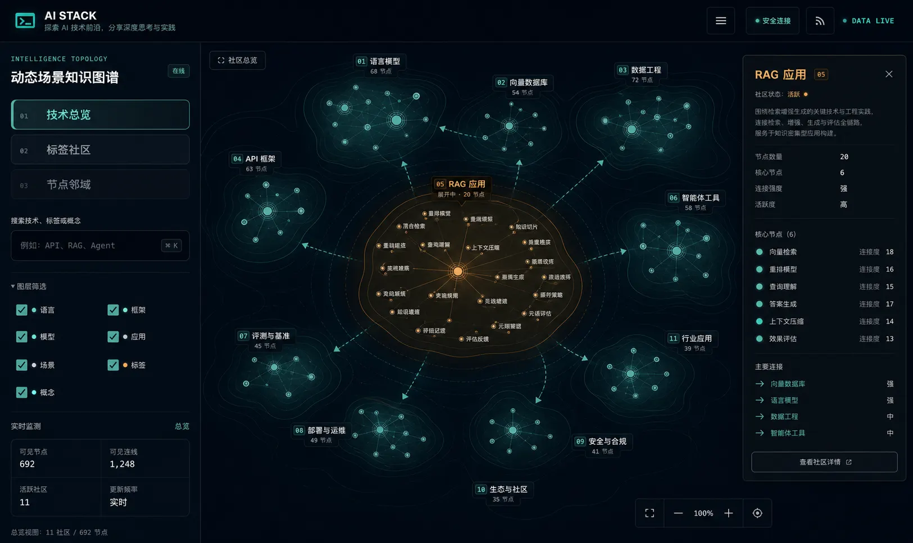
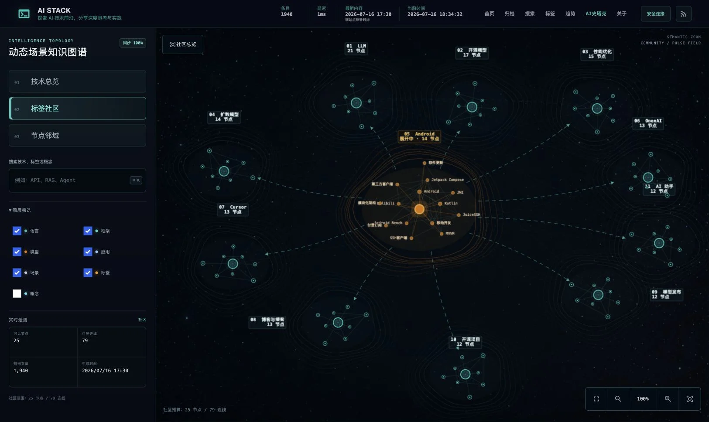
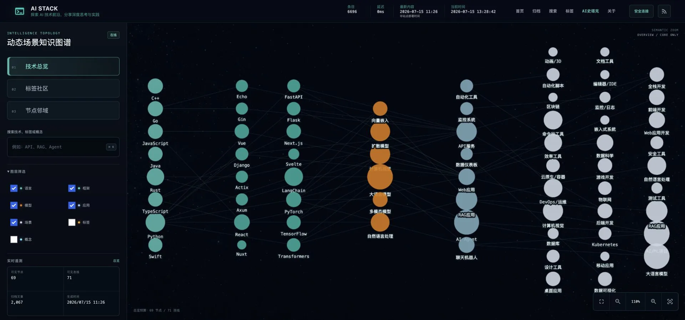
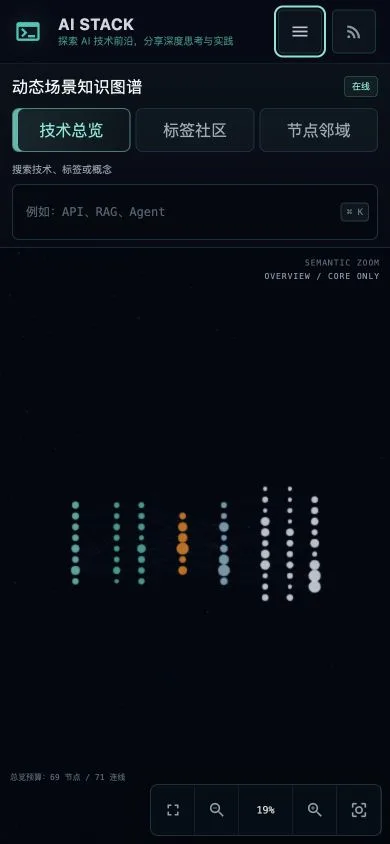

# AI Stack 图谱与全站 Header 设计验收

验收日期：2026-07-15

验收基线：`codex/history-tags-header-fix`

目标：在保留 AI Stack 原有赛博终端视觉与全站导航的前提下，实现分层加载的动态社区知识图谱，并保证所有用户可见页面头部一致。

## 同视口视觉对照

参考图与最终实现均为 1625×968，状态均为“社区已展开 + 详情抽屉可见”。

| 参考图 | 最终实现 |
| --- | --- |
|  |  |

实现保留了参考图的左侧工作台、外围社区场、中心琥珀热点、社区路径和右侧详情抽屉。以下差异为明确的产品约束，不属于视觉缺陷：

- 顶部使用全站唯一共享 Header，而不是参考图中的图谱专属 Header。
- 节点名称、文章数、连接强度与社区规模全部来自真实生成数据，不使用参考图中的演示数字。
- 社区展开限制为 24 个热点；本次实测为 22 节点、52 连线，以维持交互帧率和可读性。

## 响应式证据

| 1920×900 宽屏 | 390×844 移动端 |
| --- | --- |
|  |  |

- 宽屏 Header 高度 64px；图谱容器、Cytoscape Canvas 与页面可用列宽一致，无水平溢出。
- 2048px 视口测试时，应用内截图器受宿主 1961px 可视宽限制而截去 87px；1920px 复测完整，确认不是页面裁切。
- 移动端 Header 高度 64px，菜单与 RSS 触控区均为 44×44px；菜单可打开，Esc 可关闭；页面无横向滚动。

## 全站 Header 契约

对首页、文章列表、文章详情、标签总览、标签详情、分类总览、分类详情、图谱、场景详情、搜索、关于、归档与 404 共 13 个构建产物进行了浏览器测量：

- 每页只存在一个 `[data-site-header]`。
- 每页只加载一份 `style.css` 与一份 `tailwind.css`。
- Header 均为 64px，标题均为 16px/16px，说明均为 11px。
- 字体栈、品牌、遥测三行基线、导航顺序和子路径激活态一致。
- 404 的 CRT 闪烁只作用于正文，不再影响 Header。

## 交互与可靠性

- `03 节点邻域`：25 节点、24 连线，按钮可点击且真实切换到邻域模式。
- `02 标签社区`：首层 11 节点、10 连线；展开社区后 22 节点、52 连线并显示社区详情。
- 搜索 `api`：返回 10 条分层结果；ArrowDown + Enter 聚焦 `API` 并切换到邻域模式。
- 搜索、社区、邻域均未超过 100 节点/500 连线验收上限。
- 图谱、搜索与 Header 交互过程中浏览器 console error/warning：0。
- Python、Node、Hugo、Pagefind、图谱验证和静态产物测试全部通过。

## 缺陷结论

- P0：0
- P1：0
- P2：0
- P3：0（真实数据密度与参考演示数据不同，为预期差异）

final result: passed
