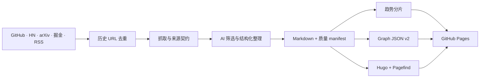

# AI Stack 使用文档

AI Stack 是“AI 情报长期档案 + 动态场景知识图谱”。它把多源采集、历史去重、内容整理、趋势挖掘、图谱探索、静态检索和 GitHub Pages 发布放进一个可版本化仓库。

## 导航

- [60 秒启动 UI](#60-秒启动-ui)
- [完整情报流水线](#完整情报流水线)
- [配置](#配置)
- [内容与历史质量](#内容与历史质量)
- [趋势洞察](#趋势洞察)
- [动态知识图谱](#动态知识图谱)
- [测试与构建](#测试与构建)
- [故障排查](#故障排查)
- [安全与成本](#安全与成本)

## 60 秒启动 UI

该路径只读取仓库中已经提交的 Markdown 和静态数据，不调用模型，也不需要 Python、数据库或容器。

```bash
git clone https://github.com/g5n-dev/ai-stack.git
cd ai-stack/blog
hugo server -D
```

打开 `http://localhost:1313/`：

- `/`：前沿情报流。
- `/posts/`：长期归档。
- `/search/`：Pagefind 静态检索。
- `/trends/`：趋势筛选、评分解释与下钻。
- `/scenarios/`：技术总览、标签社区与节点邻域。

## 完整情报流水线

### 前置条件

- Python 3.11–3.13
- Hugo Extended 0.153.4
- Node.js 22（构建 CSS 和 Pagefind 时需要）
- 一个兼容 Anthropic Messages 请求结构的模型端点

### 安装

```bash
git clone https://github.com/g5n-dev/ai-stack.git
cd ai-stack
bash scripts/setup.sh
```

脚本会创建 `venv`、安装 `requirements.txt` 并从 `.env.example` 复制本地 `.env`。随后填写明显占位符对应的真实值：

```env
ANTHROPIC_AUTH_TOKEN=replace_with_your_token
ANTHROPIC_BASE_URL=https://llm.example.com/anthropic
ANTHROPIC_MODEL=replace_with_your_model_id
```

预检：

```bash
source venv/bin/activate
python3 scripts/preflight.py --require-hugo
```

运行采集、处理、质量清单、趋势构建、Hugo 构建与本地服务：

```bash
bash scripts/run_local.sh --serve
```

只生成并校验内容、不执行 Hugo build：

```bash
bash scripts/run_local.sh --skip-build
```

## 系统闭环



固定基础设施保持极简：仓库保存数据，Actions 负责短时计算，Pages 提供静态发布。模型/API 用量、可选域名或自建搜索可能产生外部成本。

## 配置

### 来源

[`config/sources.yaml`](../config/sources.yaml) 控制来源开关、预算、超时、并发和搜索兜底。生产任务当前覆盖：

- GitHub Trending
- Hacker News
- arXiv
- 掘金
- 博客/播客 RSS

Reddit、X/Twitter 与 SearXNG 可以在本地按配置启用。增加来源时必须同时实现规范 URL、超时、内容完整性和去重测试。

### 模型

[`config/anthropic.yaml`](../config/anthropic.yaml) 定义摘要、翻译、生成、标签、场景与模型调用参数。认证值只从环境变量读取：

- `ANTHROPIC_AUTH_TOKEN`
- `ANTHROPIC_BASE_URL`
- `ANTHROPIC_MODEL`

项目基于 Anthropic SDK 与 Messages 请求结构；模型 ID 和 `base_url` 可配置。不要把生产端点或认证值写回 YAML。

### 运行档位

[`runtime_profile.py`](../runtime_profile.py) 区分本地与 CI 的来源预算、并发和生成强度。生产 Actions 使用 `AI_STACK_RUNTIME_PROFILE=ci`，保证每小时任务在有界时间内完成。

### 趋势

[`config/stack_trends.yaml`](../config/stack_trends.yaml) 定义观察窗口、评分权重、排除标签和分片预算。配置变化必须重建趋势数据并验证哈希。

### 可选发布器

[`config/publisher.yaml`](../config/publisher.yaml) 中的社交发布器默认关闭。启用前应在独立环境验证权限、速率限制和脱敏日志。

## 内容与历史质量

每篇自动文章必须声明来源契约。系统区分：

- `source_brief`：来源证据有限但结构和边界明确的来源卡片。
- `evidence_backed_rewrite`：有来源快照支持的转写。
- `complete`：满足完整内容契约的页面。
- `archived`：来源无法恢复，只保留透明审计记录。
- `quarantined`：不满足公开发布条件，构建失败关闭。

生成质量清单：

```bash
python3 scripts/build_content_quality_manifest.py \
  --content-root blog/content \
  --output blog/data/content_quality.json \
  --fail-on-quarantine \
  --fail-on-structural-warning \
  --fail-on-unverified-provenance
```

检查历史修复已经达到固定点：

```bash
python3 scripts/repair_historical_content.py --check
```

核心原则：无法从来源证明的内容不以“完整原文”发布；无法恢复时明确记录失败类型、失败原因、尝试时间和原始链接。

详细说明见 [HISTORICAL_CONTENT_QUALITY.md](./HISTORICAL_CONTENT_QUALITY.md)。

## 趋势洞察

趋势是确定性静态快照，不宣称实时流。它复用已经进入档案且通过质量闸门的证据，支持：

- 24 小时、7 天、30 天观察窗口。
- 新出现、上升、稳定、降温状态。
- 来源、场景、信号状态与主题搜索。
- hover/focus 查看评分、证据量与来源多样性。
- 下钻到证据文章和相关图谱节点。

重建与验证：

```bash
python3 scripts/build_stack_trends.py
python3 scripts/verify_stack_trends.py \
  --root blog/static/data/stack-trends \
  --verify-hashes
```

趋势 URL 使用有界查询参数，例如：

```text
https://ai-stack.site/trends/?window=30d&signal=rising
```

刷新或分享 URL 后，筛选状态应保持；非法或过长参数会被安全回退。

## 动态知识图谱

Graph JSON v2 采用三级渐进探索：

| 模式 | 数据策略 | 用户目标 |
| --- | --- | --- |
| 技术总览 | 首屏只加载核心图 | 看技术栈层次 |
| 标签社区 | 社区摘要 + 按需热点分片 | 看主题聚类与关联 |
| 节点邻域 | 当前节点的一跳强关系 | 聚焦技术、标签或概念 |

搜索索引覆盖全量节点，但主线程只接收当前需要的子图。社区和 focus 均有节点、边、粒子与 Canvas 像素预算。

验证已经提交的图谱：

```bash
python3 scripts/verify_graph.py --assets-only --public-dir blog/static
node --test tests/js/graph-runtime.test.js tests/js/test_graph_workbench.mjs
```

涉及图谱数据生成器时，运行 `python3 -m processor.tag_graph` 重建，再验证索引、分片哈希和确定性输出。

## 搜索与标签

Pagefind 在 Hugo 构建后生成浏览器端索引和受控结果 catalog：

```bash
cd blog
hugo --minify --cleanDestinationDir
cd ..
npm run build:search
```

搜索支持大小写归一化、来源筛选、标签筛选、键盘结果列表与安全 URL。结果正文来自经过长度和字段验证的 catalog，不直接信任外部 HTML。

标签由规范化别名表统一，配置见 [`config/tag_aliases.yaml`](../config/tag_aliases.yaml)。

## 测试与构建

### 快速回归

```bash
npm test
```

### Python 全量回归

```bash
python3 -m pytest -q
```

### 完整静态构建

```bash
npm ci --ignore-scripts
npm run build:css
cd blog
hugo --minify --cleanDestinationDir
cd ..
npm run build:search
```

### 发布清单

正式合并或部署前使用 [V1_RELEASE_CHECKLIST.md](./V1_RELEASE_CHECKLIST.md)，不要只以单个测试通过作为发布依据。

## GitHub Actions

| 工作流 | 触发 | 职责 |
| --- | --- | --- |
| `ci.yml` | PR、手动 | 稳定测试、内容固定点、趋势/图谱/搜索构建 |
| `deploy.yml` | main push、每小时第 17 分钟、手动 | 快速发布或完整数据刷新与 Pages 部署 |
| `monitoring.yml` | 每 6 小时第 23 分钟、手动 | 图谱/趋势 12 小时新鲜度与故障定位 |
| `delete-post.yml` | 手动 | 内容删除 dry run、派生资产重建与部署 |

部署细节见 [../DEPLOYMENT.md](../DEPLOYMENT.md)。

## 故障排查

### Hugo 能启动，但样式或 JS 旧

- 确认本地改动位于 Hugo 实际读取的 `blog/static`、主题 assets 或 layouts。
- 运行 `npm run build:css`。
- 删除旧的 `blog/public` 后使用 `--cleanDestinationDir` 重建。
- 线上问题要确认 PR 已合并且 Pages deployment 对应最新提交。

### 图谱停在加载状态

- 访问 `/data/tag-graph/index.json` 确认 HTTP 200。
- 执行 `scripts/verify_graph.py` 检查每个分片 path、bytes 与 sha256。
- 检查 Worker 脚本和固定版本 Cytoscape 依赖是否返回 200。

### 趋势筛选不生效

- 查看 URL 查询参数是否为支持的窗口、信号、来源和场景。
- 运行 `tests/js/test_trends.mjs` 验证过滤与 URL 同步。
- 重建趋势资产，避免模板和旧 schema 分片混用。

### 文章内容不完整

- 检查 front matter 中的 `content_mode`、来源快照与截断说明。
- 运行质量 manifest 和对应来源契约测试。
- 不用模型推测填补缺失原文；优先恢复来源或转为透明归档。

### 定时任务成功但没有新增文章

历史 URL 去重可能使本轮没有新候选，这是正常结果。查看 Actions Summary 的来源候选、重复、抓取错误和质量闸门统计。

## 安全与成本

- 静态 UI 和线上浏览不需要模型密钥。
- 完整刷新会产生模型/API 可变成本；GitHub-hosted Actions 与 Pages 的实际额度以账户和官方规则为准。
- `.env`、cookie、token、私有 endpoint 和完整请求头不得提交。
- 动态外部内容必须经过字段、长度、URL 和 DOM 输出验证。
- 生产生成失败时保持失败关闭，不用强制推送覆盖并发改动。

贡献流程见 [../CONTRIBUTING.md](../CONTRIBUTING.md)。
