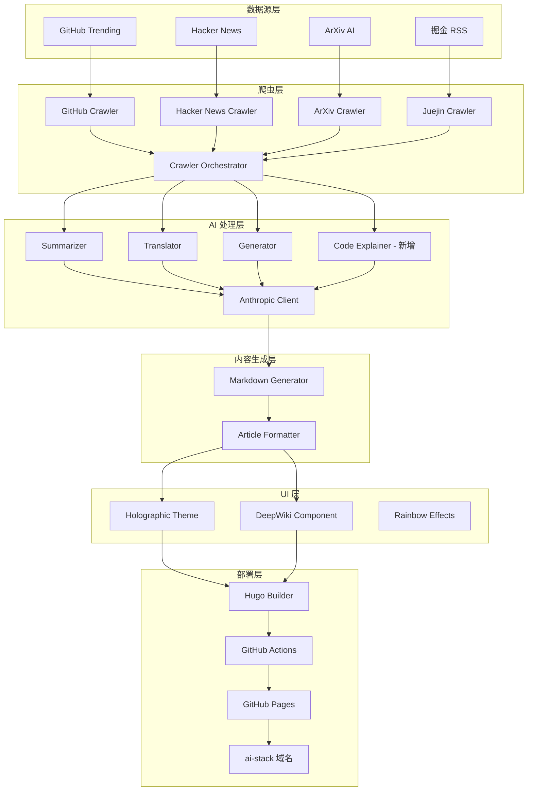
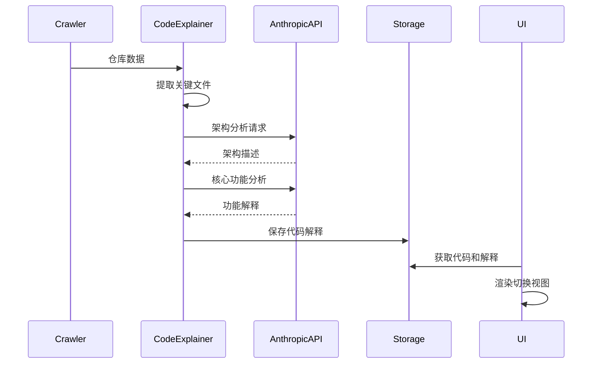
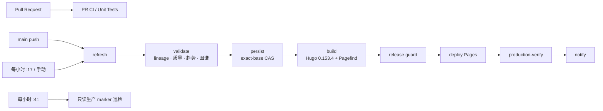
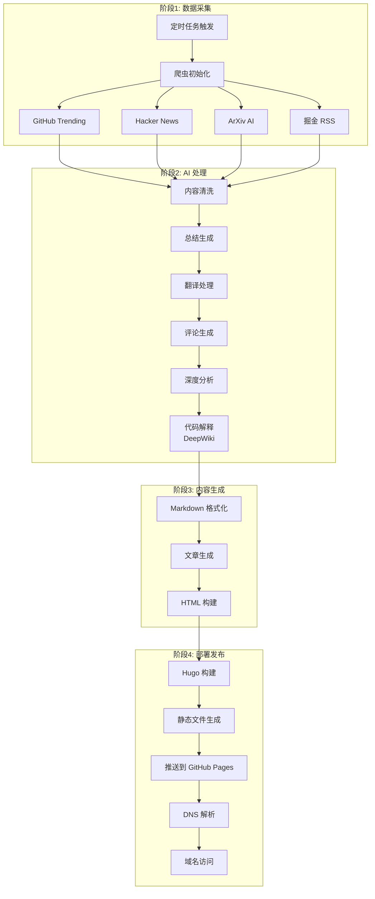

# AI Stack 系统设计文档

## 项目概述

AI Stack 是一个基于 Hugo 的自动化内容生成和发布系统，集成多数据源爬取、AI 智能处理、全息彩虹风格 UI 和 GitHub Pages 自动部署。

---

## 系统架构

### 整体架构图



---

## 一、DeepWiki 代码解释功能设计

### 1.1 功能概述

DeepWiki 是一个智能代码解释系统，能够：
- 从 GitHub 仓库提取关键代码片段
- 使用 AI 生成多维度代码解释
- 提供可切换的代码/解释视图
- 支持架构说明、核心功能解读、使用建议

### 1.2 模块设计

#### 1.2.1 CodeExplainer 模块

**文件**: `processor/code_explainer.py`

```python
class CodeExplainer:
    """代码解释器 - 核心模块"""

    def __init__(self, client: AnthropicClient):
        self.client = client

    def explain_repository(self, repo_data: Dict) -> Dict:
        """解释整个仓库代码"""
        pass

    def explain_code_snippet(self, code: str, context: str) -> Dict:
        """解释单个代码片段"""
        pass

    def extract_key_files(self, repo_url: str) -> List[str]:
        """提取仓库关键文件"""
        pass

    def generate_architecture_diagram(self, codebase: Dict) -> str:
        """生成架构图描述"""
        pass
```

#### 1.2.2 数据流



### 1.3 API 接口设计

#### 1.3.1 输入格式

```json
{
  "source": "github_trending",
  "title": "awesome-project",
  "url": "https://github.com/user/awesome-project",
  "description": "An awesome project",
  "language": "Python",
  "stars": "1000",
  "code_snippets": [
    {
      "file_path": "src/main.py",
      "code": "def main():\n    print('Hello')",
      "context": "Entry point of the application"
    }
  ]
}
```

#### 1.3.2 输出格式

```json
{
  "repository": "awesome-project",
  "architecture_explanation": {
    "overview": "整体架构说明",
    "modules": ["模块1", "模块2"],
    "data_flow": "数据流描述"
  },
  "code_analysis": [
    {
      "file_path": "src/main.py",
      "purpose": "该文件的作用",
      "key_functions": [
        {
          "name": "main",
          "description": "主函数说明",
          "complexity": "低",
          "best_practices": ["实践1", "实践2"]
        }
      ],
      "algorithms": ["使用的算法"]
    }
  ],
  "usage_recommendations": {
    "installation": "安装说明",
    "configuration": "配置说明",
    "common_use_cases": ["用例1", "用例2"],
    "pitfalls": ["常见错误1", "常见错误2"]
  }
}
```

### 1.4 集成方案

#### 1.4.1 处理流程集成

在 `processor/main.py` 中添加：

```python
class ProcessorOrchestrator:
    def __init__(self):
        self.summarizer = ContentSummarizer(...)
        self.generator = ContentGenerator(...)
        self.code_explainer = CodeExplainer(...)  # 新增

    def process_github_repo(self, repo_data: Dict) -> Dict:
        # 原有处理
        repo_data = self.summarizer.summarize_repository(repo_data)
        repo_data = self.generator.process_content(repo_data)

        # 新增：代码解释
        if repo_data.get('source') == 'github_trending':
            repo_data = self.code_explainer.explain_repository(repo_data)

        return repo_data
```

#### 1.4.2 Markdown 生成集成

在 `scripts/generate_content.py` 中扩展：

```python
def _format_github_repo(self, item: dict) -> list:
    lines = [
        # 原有内容
        '## ➜ 仓库信息',
        # ...
    ]

    # 新增：DeepWiki 代码解释
    if item.get('code_analysis'):
        lines.extend(self._format_code_explanation(item))

    return lines

def _format_code_explanation(self, item: dict) -> list:
    """格式化代码解释"""
    return [
        '',
        '## ➜ DeepWiki 代码解读',
        '',
        '<div class="deepwiki-container">',
        '  <div class="mode-toggle">',
        '    <button class="btn-code" onclick="showCode()">代码视图</button>',
        '    <button class="btn-explanation" onclick="showExplanation()">AI 解释</button>',
        '  </div>',
        '',
        '  <div id="code-view" class="code-view">',
        f'```{item.get("language", "python")}',
        item.get('original_code', '代码加载中...'),
        '```',
        '  </div>',
        '',
        '  <div id="explanation-view" class="explanation-view hidden">',
        '    ### 架构说明',
        f'    {item.get("architecture_explanation", {}).get("overview", "")}',
        '',
        '    ### 核心功能',
        # 动态生成功能列表
        '  </div>',
        '</div>',
    ]
```

---

## 二、全息彩虹风格 UI 设计

### 2.1 设计原则

#### 2.1.1 核心特性

1. **全息感**: 使用多层透明效果和模糊背景
2. **虹彩流动**: 渐变边框和背景的动态流动
3. **霓虹发光**: 元素悬停时的发光脉冲效果
4. **玻璃态**: `backdrop-filter` 实现毛玻璃效果
5. **暗色主题**: 保留终端风格的深色背景

#### 2.1.2 配色方案

```css
:root {
    /* 主色调 - 全息渐变 */
    --holographic-primary: linear-gradient(135deg, #667eea 0%, #764ba2 100%);
    --holographic-secondary: linear-gradient(135deg, #f093fb 0%, #f5576c 100%);
    --holographic-accent: linear-gradient(135deg, #4facfe 0%, #00f2fe 100%);
    --holographic-warm: linear-gradient(135deg, #fa709a 0%, #fee140 100%);
    --holographic-cool: linear-gradient(135deg, #a8edea 0%, #fed6e3 100%);

    /* 彩虹边框 */
    --rainbow-border: conic-gradient(
        from 0deg,
        #ff0000, #ff7f00, #ffff00,
        #00ff00, #0000ff, #8b00ff,
        #ff0000
    );

    /* 背景色 */
    --bg-dark: #0a0a0f;
    --bg-glass: rgba(255, 255, 255, 0.05);
    --bg-card: rgba(20, 20, 30, 0.6);

    /* 文字色 */
    --text-primary: #ffffff;
    --text-secondary: rgba(255, 255, 255, 0.7);
    --text-glow: rgba(255, 255, 255, 0.8);

    /* 强调色 */
    --accent-purple: #b983ff;
    --accent-pink: #ff6b9d;
    --accent-cyan: #4facfe;
    --accent-yellow: #ffd93d;
}
```

### 2.2 组件设计

#### 2.2.1 全息卡片

**HTML 结构**:
```html
<div class="holographic-card">
    <div class="card-border"></div>
    <div class="card-content">
        <h3 class="card-title">标题</h3>
        <p class="card-text">内容</p>
    </div>
</div>
```

**CSS 实现**:
```css
.holographic-card {
    position: relative;
    background: var(--bg-card);
    backdrop-filter: blur(12px);
    border-radius: 16px;
    overflow: hidden;
    transition: all 0.4s cubic-bezier(0.175, 0.885, 0.32, 1.275);
}

.holographic-card::before {
    content: '';
    position: absolute;
    inset: -2px;
    background: var(--rainbow-border);
    border-radius: 18px;
    z-index: -1;
    animation: rainbowRotate 4s linear infinite;
}

.holographic-card:hover {
    transform: translateY(-5px) scale(1.02);
    box-shadow:
        0 0 30px rgba(102, 126, 234, 0.4),
        0 0 60px rgba(185, 131, 255, 0.2);
}

@keyframes rainbowRotate {
    from {
        transform: rotate(0deg);
    }
    to {
        transform: rotate(360deg);
    }
}
```

#### 2.2.2 DeepWiki 切换组件

**HTML 结构**:
```html
<div class="deepwiki-container">
    <div class="deepwiki-header">
        <h3 class="holographic-title">DeepWiki 代码解读</h3>
        <div class="mode-switch">
            <button class="switch-btn active" data-mode="code">
                <span class="btn-icon">💻</span>
                <span class="btn-text">代码视图</span>
            </button>
            <button class="switch-btn" data-mode="explanation">
                <span class="btn-icon">🤖</span>
                <span class="btn-text">AI 解释</span>
            </button>
        </div>
    </div>

    <div class="deepwiki-body">
        <div class="view-section code-view">
            <div class="code-block-wrapper">
                <div class="code-header">
                    <span class="file-name">main.py</span>
                    <button class="copy-btn">复制</button>
                </div>
                <pre><code class="language-python">代码内容</code></pre>
            </div>
        </div>

        <div class="view-section explanation-view hidden">
            <div class="explanation-section">
                <h4 class="section-title">
                    <span class="title-icon">🏗️</span>
                    架构说明
                </h4>
                <div class="holographic-text">架构内容</div>
            </div>

            <div class="explanation-section">
                <h4 class="section-title">
                    <span class="title-icon">⚡</span>
                    核心功能
                </h4>
                <ul class="feature-list">
                    <li class="feature-item">功能 1</li>
                </ul>
            </div>

            <div class="explanation-section">
                <h4 class="section-title">
                    <span class="title-icon">🎯</span>
                    使用建议
                </h4>
                <div class="holographic-text">建议内容</div>
            </div>
        </div>
    </div>
</div>
```

**CSS 实现**:
```css
.deepwiki-container {
    background: var(--bg-card);
    backdrop-filter: blur(16px);
    border-radius: 20px;
    padding: 30px;
    margin: 30px 0;
    position: relative;
    overflow: hidden;
}

.deepwiki-container::before {
    content: '';
    position: absolute;
    inset: 0;
    background: var(--holographic-primary);
    opacity: 0.1;
    z-index: -1;
    animation: holographicGlow 8s ease-in-out infinite alternate;
}

.deepwiki-header {
    display: flex;
    justify-content: space-between;
    align-items: center;
    margin-bottom: 25px;
    padding-bottom: 20px;
    border-bottom: 2px solid;
    border-image: var(--holographic-accent) 1;
}

.holographic-title {
    font-size: 24px;
    font-weight: bold;
    background: var(--holographic-secondary);
    -webkit-background-clip: text;
    -webkit-text-fill-color: transparent;
    background-clip: text;
    animation: textGlow 2s ease-in-out infinite alternate;
}

.mode-switch {
    display: flex;
    gap: 10px;
}

.switch-btn {
    background: rgba(255, 255, 255, 0.1);
    border: 2px solid transparent;
    border-radius: 10px;
    padding: 10px 20px;
    cursor: pointer;
    transition: all 0.3s;
    display: flex;
    align-items: center;
    gap: 8px;
}

.switch-btn:hover {
    background: rgba(255, 255, 255, 0.15);
    transform: translateY(-2px);
}

.switch-btn.active {
    background: var(--holographic-accent);
    border-color: rgba(79, 172, 254, 0.5);
    box-shadow: 0 0 20px rgba(79, 172, 254, 0.4);
}

.code-block-wrapper {
    background: rgba(0, 0, 0, 0.4);
    border-radius: 12px;
    border: 1px solid rgba(255, 255, 255, 0.1);
    overflow: hidden;
}

.code-header {
    background: rgba(255, 255, 255, 0.05);
    padding: 12px 16px;
    display: flex;
    justify-content: space-between;
    align-items: center;
}

.file-name {
    color: var(--accent-cyan);
    font-family: 'Fira Code', monospace;
    font-size: 14px;
}

.copy-btn {
    background: var(--holographic-accent);
    border: none;
    border-radius: 6px;
    padding: 6px 12px;
    color: white;
    cursor: pointer;
    font-size: 12px;
    transition: all 0.3s;
}

.copy-btn:hover {
    transform: scale(1.05);
    box-shadow: 0 0 15px rgba(79, 172, 254, 0.5);
}

.explanation-section {
    margin-bottom: 30px;
}

.section-title {
    font-size: 20px;
    margin-bottom: 15px;
    display: flex;
    align-items: center;
    gap: 10px;
    background: var(--holographic-primary);
    -webkit-background-clip: text;
    -webkit-text-fill-color: transparent;
    background-clip: text;
}

.feature-list {
    list-style: none;
    padding: 0;
}

.feature-item {
    background: rgba(255, 255, 255, 0.05);
    margin-bottom: 10px;
    padding: 12px 16px;
    border-radius: 8px;
    border-left: 3px solid var(--accent-purple);
    transition: all 0.3s;
}

.feature-item:hover {
    background: rgba(255, 255, 255, 0.1);
    transform: translateX(5px);
    border-left-color: var(--accent-pink);
}

@keyframes holographicGlow {
    0% {
        opacity: 0.05;
        filter: hue-rotate(0deg);
    }
    100% {
        opacity: 0.15;
        filter: hue-rotate(60deg);
    }
}

@keyframes textGlow {
    0% {
        filter: drop-shadow(0 0 2px rgba(185, 131, 255, 0.5));
    }
    100% {
        filter: drop-shadow(0 0 8px rgba(185, 131, 255, 0.8));
    }
}
```

#### 2.2.3 终端容器升级

```css
.terminal-container {
    background: linear-gradient(
        180deg,
        var(--bg-dark) 0%,
        rgba(10, 10, 15, 0.95) 100%
    );
    position: relative;
}

.terminal-container::before {
    content: '';
    position: fixed;
    top: -50%;
    left: -50%;
    width: 200%;
    height: 200%;
    background:
        radial-gradient(circle at 20% 50%, rgba(102, 126, 234, 0.1) 0%, transparent 50%),
        radial-gradient(circle at 80% 20%, rgba(185, 131, 255, 0.1) 0%, transparent 50%),
        radial-gradient(circle at 40% 80%, rgba(79, 172, 254, 0.1) 0%, transparent 50%);
    animation: bgShift 20s ease-in-out infinite;
    z-index: -1;
    pointer-events: none;
}

.terminal-header {
    background: rgba(20, 20, 30, 0.8);
    backdrop-filter: blur(20px);
    border: 1px solid rgba(255, 255, 255, 0.1);
    position: relative;
    overflow: hidden;
}

.terminal-header::before {
    content: '';
    position: absolute;
    top: 0;
    left: 0;
    right: 0;
    height: 3px;
    background: var(--holographic-accent);
    animation: borderGlow 3s ease-in-out infinite alternate;
}

@keyframes bgShift {
    0%, 100% {
        transform: translate(0, 0);
    }
    25% {
        transform: translate(5%, 5%);
    }
    50% {
        transform: translate(-5%, 10%);
    }
    75% {
        transform: translate(10%, -5%);
    }
}

@keyframes borderGlow {
    0% {
        opacity: 0.5;
        filter: brightness(1);
    }
    100% {
        opacity: 1;
        filter: brightness(1.5);
    }
}
```

### 2.3 动画效果

#### 2.3.1 流动彩虹边框

```javascript
// 动态更新 CSS 变量实现流动效果
function updateRainbowBorder() {
    const cards = document.querySelectorAll('.holographic-card');

    cards.forEach((card, index) => {
        const hue = (Date.now() / 50 + index * 60) % 360;
        const color1 = `hsl(${hue}, 80%, 60%)`;
        const color2 = `hsl(${(hue + 60) % 360}, 80%, 60%)`;
        const color3 = `hsl(${(hue + 120) % 360}, 80%, 60%)`;
        const color4 = `hsl(${(hue + 180) % 360}, 80%, 60%)`;
        const color5 = `hsl(${(hue + 240) % 360}, 80%, 60%)`;
        const color6 = `hsl(${(hue + 300) % 360}, 80%, 60%)`;

        card.style.setProperty('--rainbow-border',
            `conic-gradient(from ${hue}deg, ${color1}, ${color2}, ${color3}, ${color4}, ${color5}, ${color6}, ${color1})`
        );
    });

    requestAnimationFrame(updateRainbowBorder);
}

updateRainbowBorder();
```

#### 2.3.2 DeepWiki 视图切换

```javascript
class DeepWikiToggle {
    constructor(container) {
        this.container = container;
        this.codeView = container.querySelector('.code-view');
        this.explanationView = container.querySelector('.explanation-view');
        this.buttons = container.querySelectorAll('.switch-btn');
        this.activeMode = 'code';

        this.init();
    }

    init() {
        this.buttons.forEach(btn => {
            btn.addEventListener('click', () => {
                const mode = btn.dataset.mode;
                this.switchMode(mode);
            });
        });
    }

    switchMode(mode) {
        this.activeMode = mode;

        // 更新按钮状态
        this.buttons.forEach(btn => {
            btn.classList.toggle('active', btn.dataset.mode === mode);
        });

        // 切换视图（带动画）
        if (mode === 'code') {
            this.explanationView.style.opacity = '0';
            setTimeout(() => {
                this.explanationView.classList.add('hidden');
                this.codeView.classList.remove('hidden');
                requestAnimationFrame(() => {
                    this.codeView.style.opacity = '1';
                });
            }, 300);
        } else {
            this.codeView.style.opacity = '0';
            setTimeout(() => {
                this.codeView.classList.add('hidden');
                this.explanationView.classList.remove('hidden');
                requestAnimationFrame(() => {
                    this.explanationView.style.opacity = '1';
                });
            }, 300);
        }
    }
}

// 初始化所有 DeepWiki 组件
document.querySelectorAll('.deepwiki-container').forEach(container => {
    new DeepWikiToggle(container);
});
```

---

## 三、GitHub 部署与域名配置设计

### 3.1 部署架构



### 3.2 GitHub Actions 工作流

生产配置以仓库内工作流为唯一事实来源：

| 工作流 | 触发 | 责任边界 |
| --- | --- | --- |
| `.github/workflows/ci.yml` | Pull Request、手动 | Python/JavaScript 测试、内容来源门禁、图谱浏览器烟测、Hugo 与 Pagefind 构建；只读权限 |
| `.github/workflows/deploy.yml` | `main` push、每小时第 17 分钟、手动 | 七段权限隔离 DAG；精确 SHA 固定点、Pages 部署、生产烟测与验证后通知 |
| `.github/workflows/monitoring.yml` | 每小时第 41 分钟、手动 | 只读比较 `main` 与生产 marker；3 小时收敛、12 小时陈旧阈值 |
| `.github/workflows/production-recovery.yml` | 手动 | 只恢复有 90 天生产验证回执的完整 `main` 祖先 SHA |
| `.github/workflows/delete-post.yml` | 手动 | 分离只读分析与受控 writer，重建派生数据后触发主部署 |

部署不维护独立发布分支。`refresh` 可读取模型密钥但只有 read 权限；`persist` 有 Git 写权但无模型密钥；`deploy` 单独持有 Pages 写权。`main` push 不调用模型，定时或显式刷新才采集。数据按 `lineage → content quality → trends → graph` 重建，趋势按稳定 `event_id` 计数且只合并 allowlist 认可的 `same_event`。

模型令牌、端点及搜索服务配置只保存在 GitHub Actions Secrets 中。日志只记录失败阶段和公开错误类型，不回显密钥、完整请求地址或第三方响应正文。开发者在推送前可执行 `bash scripts/deploy.sh` 复现本地发布边界；该脚本只做预检，不直接部署。

### 3.3 DNS 配置

#### 3.3.1 DNS 记录

**裸域名配置 (`ai-stack.site`)**:

```
类型: A
主机记录: @
记录值:
  - 185.199.108.153
  - 185.199.109.153
  - 185.199.110.153
  - 185.199.111.153
TTL: 600
```

**可选子域名配置**:

```
类型: CNAME
主机记录: ai
记录值: 按 GitHub Pages 设置页给出的目标填写
TTL: 600
```

#### 3.3.2 CNAME 文件

自定义域名由 GitHub Pages 设置管理；如使用 CNAME 文件，应放入 Hugo 会复制到发布目录的静态资源路径。

```
ai-stack.site
```

### 3.4 配置管理

#### 3.4.1 Secrets 配置

在 GitHub 仓库 Settings > Secrets and variables > Actions 中配置：

| Secret 名称 | 说明 | 示例值 |
|-------------|------|---------|
| `ANTHROPIC_AUTH_TOKEN` | 模型端点认证令牌 | `replace_with_your_token` |
| `ANTHROPIC_BASE_URL` | Anthropic Messages 兼容基础地址 | `https://llm.example.com/anthropic` |
| `ANTHROPIC_MODEL` | 模型 ID | `replace_with_your_model_id` |
| `SEARXNG_BASE_URL` | 可选自建搜索兜底 | `https://search.example.com` |
| `GOOGLE_INDEXING_API_KEY` | 可选搜索索引通知 | `replace_with_indexing_key` |
| `GOOGLE_INDEXING_API_URL` | 可选索引通知地址 | `https://indexing.example.com/notify` |

IndexNow 使用 repository Variable `BING_INDEXNOW_OWNERSHIP_KEY`。它是必须单独生成的公开 ownership key，不是 Secret，不能复用任何模型、GitHub 或其他服务凭据。可选社交发布器位于 `config/publisher.yaml` 且默认关闭，不属于当前生产发布主链。

#### 3.4.2 Hugo 配置

Hugo 的当前值只在 [`blog/config.toml`](../blog/config.toml) 维护，文档不复制整份配置快照，避免主题参数、描述和交互开关随实现演进而漂移。生产构建显式传入 `--baseURL "https://ai-stack.site/" --minify --cleanDestinationDir`。

---

## 四、数据流设计

### 4.1 完整数据流



### 4.2 数据模型

#### 4.2.1 仓库数据模型

```python
@dataclass
class GitHubRepository:
    """GitHub 仓库数据模型"""
    title: str
    url: str
    description: str
    language: str
    stars: str
    forks: str
    today_stars: str
    source: str = 'github_trending'
    crawled_at: str

    # AI 生成字段
    summary: str = ''
    generated_intro: str = ''
    generated_comment: str = ''
    generated_analysis: str = ''

    # DeepWiki 字段
    code_snippets: List[dict] = field(default_factory=list)
    architecture_explanation: dict = field(default_factory=dict)
    code_analysis: List[dict] = field(default_factory=list)
    usage_recommendations: dict = field(default_factory=dict)
```

#### 4.2.2 Hacker News 数据模型

```python
@dataclass
class HackerNewsStory:
    """Hacker News 故事数据模型"""
    title: str
    url: str
    author: str
    score: int
    time: int
    descendants: int
    hn_id: int
    source: str = 'hacker_news'
    crawled_at: str

    # AI 生成字段
    summary: str = ''
    generated_comment: str = ''
```

---

## 五、性能优化

### 5.1 前端性能优化

#### 5.1.1 CSS 优化

```css
/* 使用硬件加速 */
.holographic-card {
    transform: translateZ(0);
    backface-visibility: hidden;
    will-change: transform, box-shadow;
}

/* 避免重排 */
.container {
    contain: layout style paint;
}
```

#### 5.1.2 JavaScript 优化

```javascript
// 使用 requestAnimationFrame
function animate() {
    requestAnimationFrame(animate);
    // 动画逻辑
}

// 节流处理
function throttle(func, limit) {
    let inThrottle;
    return function() {
        if (!inThrottle) {
            func.apply(this, arguments);
            inThrottle = true;
            setTimeout(() => inThrottle = false, limit);
        }
    };
}

// 懒加载图片
const imgObserver = new IntersectionObserver((entries) => {
    entries.forEach(entry => {
        if (entry.isIntersecting) {
            const img = entry.target;
            img.src = img.dataset.src;
            imgObserver.unobserve(img);
        }
    });
});

document.querySelectorAll('img[data-src]').forEach(img => {
    imgObserver.observe(img);
});
```

### 5.2 后端性能优化

#### 5.2.1 爬虫并发

```python
from concurrent.futures import ThreadPoolExecutor, as_completed

class CrawlerOrchestrator:
    def crawl_all(self) -> Dict:
        results = {}
        with ThreadPoolExecutor(max_workers=4) as executor:
            futures = {
                executor.submit(crawler.fetch): name
                for name, crawler in self.crawlers.items()
            }

            for future in as_completed(futures):
                name = futures[future]
                try:
                    results[name] = future.result()
                except Exception as e:
                    logger.error(f"Failed: {e}")
                    results[name] = []

        return results
```

#### 5.2.2 API 缓存

```python
from functools import lru_cache
from datetime import datetime, timedelta

class CacheManager:
    def __init__(self, expire_hours=24):
        self.expire_hours = expire_hours
        self.cache = {}

    def get(self, key: str):
        if key not in self.cache:
            return None

        data, timestamp = self.cache[key]
        if datetime.now() - timestamp > timedelta(hours=self.expire_hours):
            del self.cache[key]
            return None

        return data

    def set(self, key: str, value):
        self.cache[key] = (value, datetime.now())
```

---

## 六、安全设计

### 6.1 API 密钥管理

- 使用 GitHub Secrets 存储敏感信息
- 不在代码中硬编码密钥
- 定期轮换 API 密钥

### 6.2 内容安全

```python
# 输入清理
import re

def sanitize_input(text: str) -> str:
    # 移除危险的 HTML 标签
    text = re.sub(r'<script.*?>.*?</script>', '', text, flags=re.IGNORECASE)
    text = re.sub(r'<iframe.*?>.*?</iframe>', '', text, flags=re.IGNORECASE)

    # 转义特殊字符
    text = text.replace('&', '&amp;')
    text = text.replace('<', '&lt;')
    text = text.replace('>', '&gt;')

    return text
```

---

## 七、监控和日志

### 7.1 日志级别

```python
import logging

logging.basicConfig(
    level=logging.INFO,
    format='%(asctime)s - %(name)s - %(levelname)s - %(message)s',
    handlers=[
        logging.FileHandler('logs/ai-stack.log'),
        logging.StreamHandler()
    ]
)

logger = logging.getLogger(__name__)
```

### 7.2 错误追踪

```python
import traceback

try:
    # 业务逻辑
    result = process_data()
except Exception as e:
    logger.error(f"Error: {e}")
    logger.error(traceback.format_exc())
    # 发送告警通知
    send_alert(f"Critical error: {e}")
```

---

## 八、扩展性设计

### 8.1 插件化架构

```python
class CrawlerPlugin:
    """爬虫插件基类"""

    def fetch(self) -> List[Dict]:
        raise NotImplementedError

    def enabled(self) -> bool:
        return True

class PluginManager:
    def __init__(self):
        self.plugins = []

    def register(self, plugin: CrawlerPlugin):
        self.plugins.append(plugin)

    def crawl_all(self):
        results = {}
        for plugin in self.plugins:
            if plugin.enabled():
                results[plugin.__class__.__name__] = plugin.fetch()
        return results
```

---

## 总结

本系统设计文档涵盖了：

1. ✅ DeepWiki 代码解释功能 - 智能代码分析和解读
2. ✅ 全息彩虹风格 UI - 现代化视觉效果
3. ✅ GitHub 自动部署 - CI/CD 自动化流程
4. ✅ 自定义域名配置 - ai-stack 域名访问
5. ✅ 定时抓取配置 - 多数据源自动采集
6. ✅ 性能优化 - 前后端性能优化
7. ✅ 安全设计 - API 密钥和内容安全
8. ✅ 监控日志 - 完善的日志和监控系统

### 下一步实施

1. 实现 CodeExplainer 模块
2. 创建全息彩虹样式文件
3. 配置 GitHub Actions 和 DNS
4. 测试完整部署流程
5. 优化性能和用户体验
